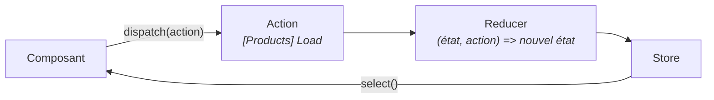

# Bonus — Ouvertures

Vous avez terminé les 8 chapitres. Cette page n'est **pas** un TP : c'est un tour d'horizon
de ce que vous rencontrerez ensuite sur un vrai projet. Chaque section tient en quelques
lignes et un lien — de quoi savoir que ça existe, à quoi ça sert, et quand s'y intéresser.

---

## 🔐 1 — L'intercepteur HTTP

**Le besoin.** Après le chapitre 7, vous avez une session. Mais chaque appel à l'API devrait
maintenant porter un jeton d'authentification. Le faire à la main dans chaque méthode du
service serait répétitif — et un oubli serait un bug de sécurité.

**La solution.** Un **intercepteur** est une fonction qui voit passer **toutes** les requêtes
sortantes, et peut les modifier au vol.

```ts
export const authInterceptor: HttpInterceptorFn = (req, next) => {
  // Suppose un signal `token` que vous ajouteriez à votre AuthService du chapitre 7.
  const token = inject(AuthService).token();
  if (!token) {
    return next(req);
  }
  // Une requête est immuable : on la CLONE en ajoutant l'en-tête.
  const authReq = req.clone({
    setHeaders: { Authorization: `Bearer ${token}` },
  });
  return next(authReq);
};
```

On le branche à l'endroit où `HttpClient` est déclaré :

```ts
provideHttpClient(withInterceptors([authInterceptor]))
```

Les usages classiques, au-delà du jeton : journaliser les requêtes, afficher un indicateur de
chargement global, réessayer automatiquement en cas d'échec réseau, ou rediriger vers la page
de connexion sur une réponse `401`.

> ⚠️ Vous croiserez l'ancienne forme, à base de classes et du jeton `HTTP_INTERCEPTORS`. Elle
> fonctionne encore (c'est à quoi sert `withInterceptorsFromDi()`), mais les intercepteurs
> **fonctionnels** ci-dessus sont la forme actuelle.

> 📖 [Intercepteurs HTTP](https://angular.dev/guide/http/interceptors)

---

## 🗃️ 2 — La gestion d'état centralisée

**Le besoin.** Au chapitre 5, un service a suffi pour partager le panier. Mais quand quinze
composants lisent et modifient le même état, on finit par ne plus savoir *qui* a changé *quoi*
ni *quand*. Les bugs deviennent difficiles à reproduire.

**La solution.** Un **magasin** (*store*) centralise l'état et impose un flux unidirectionnel :
un composant *demande* un changement (une **action**), une fonction pure calcule le nouvel état
(un **reducer**), et tous les abonnés reçoivent la mise à jour.



| Outil | Quand l'envisager |
|---|---|
| [NgRx Store](https://ngrx.io/) | Le standard historique. Puissant, verbeux, très outillé |
| [NgRx Signal Store](https://ngrx.io/guide/signals) | Même idée sur les signaux. Bien plus léger — **à préférer sur un projet récent** |
| [Elf](https://ngneat.github.io/elf/), [Akita](https://opensource.salesforce.com/akita/) | Alternatives plus légères |

> ℹ️ **Ne sortez pas l'artillerie trop tôt.** Un service avec un `signal` ou un
> `BehaviorSubject` — ce que vous avez fait au chapitre 5 — suffit à l'immense majorité des
> applications. Un magasin se justifie quand l'état est **vraiment** partagé et complexe. Son
> vrai apport est la traçabilité : avec les DevTools NgRx, on rejoue l'historique des actions.

---

## 🚀 3 — Le préchargement, plus finement

Le chapitre 3 a présenté `PreloadAllModules` : tout précharger dès que l'application est au
repos. Sur une grosse application, c'est parfois trop.

On peut écrire une stratégie sur mesure, par exemple pour ne précharger que les routes
marquées :

```ts
@Injectable({ providedIn: 'root' })
export class SelectivePreload implements PreloadingStrategy {
  preload(route: Route, load: () => Observable<unknown>): Observable<unknown> {
    return route.data?.['preload'] ? load() : of(null);
  }
}
```

```ts
{ path: 'products', data: { preload: true }, loadChildren: ... }
```

Les critères possibles : la fréquence de visite, le type de connexion
(`navigator.connection.effectiveType`), ou le rôle de l'utilisateur.

> 📖 [Stratégies de chargement](https://angular.dev/guide/routing/loading-strategies)

---

## 🧰 4 — L'outillage du quotidien

Ce que vous trouverez installé sur la plupart des projets sérieux.

| Outil | À quoi ça sert | Commande / lien |
|---|---|---|
| **[Angular DevTools](https://angular.dev/tools/devtools)** | Extension navigateur : inspecte l'arbre des composants, profile la détection de changement | À installer dans Chrome/Firefox |
| **[ESLint](https://angular.dev/tools/cli/eslint)** | Repère les erreurs et impose un style commun | `ng add @angular/eslint` |
| **[Prettier](https://prettier.io/)** | Formate le code automatiquement — fin des débats sur l'indentation | Déjà présent dans votre projet |
| **[Compodoc](https://compodoc.app/)** | Génère un site de documentation depuis le code et les commentaires | `npx @compodoc/compodoc -p tsconfig.json -s` |
| **[Storybook](https://storybook.js.org/)** | Catalogue interactif des composants, isolés de l'application | `npx storybook@latest init` |
| **[Angular Material](https://material.angular.dev/)** | Vous l'avez utilisé — explorez le reste : tableaux, dialogues, menus | — |

**Compodoc** mérite un essai : une seule commande produit un site navigable avec l'arbre des
modules, les dépendances entre composants et un graphe de routes. Très utile pour reprendre un
projet inconnu — ou pour transmettre le vôtre.

**Storybook** prend son sens quand l'équipe construit une bibliothèque de composants partagée :
chaque composant y est documenté dans tous ses états, et les designers peuvent les regarder
sans lancer l'application.

---

## 🔄 5 — Moderniser une application existante

Si vous êtes arrivé par le parcours LEGACY et voulez migrer, sachez que **rien n'oblige à tout
réécrire**. Angular permet une bascule progressive : un composant autonome peut être importé
dans un `NgModule`, et l'inverse fonctionne aussi.

Angular fournit des migrations automatiques :

```bash
ng generate @angular/core:standalone       # convertit les composants en autonomes
ng generate @angular/core:signal-input-migration   # @Input() -> input()
ng generate @angular/core:inject-migration         # constructeur -> inject()
```

L'ordre conseillé, du moins risqué au plus structurant :

1. Passer les composants en `standalone: true` (ils restent utilisables par les modules)
2. Remplacer `@Input()`/`@Output()` par `input()`/`output()`
3. Remplacer l'injection par constructeur par `inject()`
4. Supprimer les modules devenus vides
5. Enfin seulement, envisager le mode zoneless

> 📖 [Guide de migration vers standalone](https://angular.dev/reference/migrations/standalone)
>
> ⚠️ **Une migration se fait sous tests.** C'est tout l'intérêt du chapitre 8 : sans filet, une
> migration automatique sur une grosse application est un pari.

---

## 📚 6 — Pour continuer à apprendre

| Ressource | Pourquoi |
|---|---|
| [angular.dev](https://angular.dev/) | La documentation officielle, refaite en 2024 — excellente, avec tutoriels interactifs |
| [Angular Blog](https://blog.angular.dev/) | Les annonces de version : c'est là qu'on apprend ce qui change |
| [RxJS — learnrxjs.io](https://www.learnrxjs.io/) | Les opérateurs, avec des exemples exécutables |
| [Angular University](https://blog.angular-university.io/) | Articles de fond sur les sujets avancés |
| [Update Guide](https://angular.dev/update-guide) | L'outil officiel pour passer d'une version à l'autre |

---

## 🎓 Et maintenant ?

Quelques pistes pour prolonger le lab par vous-même, de la plus simple à la plus ambitieuse :

1. **Une page de détail produit** — une route avec paramètre (`/products/:id`), et la
   récupération de ce paramètre dans le composant. *(Notion neuve : `ActivatedRoute`.)*
2. **La suppression et la modification** — compléter le CRUD commencé au chapitre 6.
3. **Un vrai panier** — une page dédiée listant les articles, avec quantités et total.
   Le `CartService` existe déjà, il ne demande qu'à grandir.
4. **Une vraie authentification** — remplacer la simulation par un backend qui délivre un
   jeton JWT, et brancher l'intercepteur de la section 1.
5. **Déployer** — `ng build` produit un dossier `dist/` statique, hébergeable sur Netlify,
   Vercel ou GitHub Pages en quelques minutes.

⬅️ Retour au **[README](README.md)**
