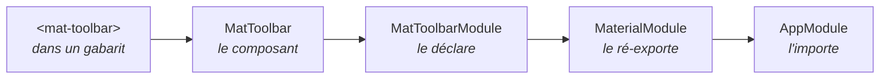

# L1 — Mise en place du projet

> 🟠 **Parcours LEGACY** — `NgModule` et RxJS.
> Chapitre équivalent en MODERN : [M1](../MODERN/M1-SCAFFOLD.md).

**Scénario à réaliser en autonomie.** Vous créez le projet en mode « modules », vous en
comprenez la structure, vous y ajoutez une bibliothèque de composants, puis vous créez votre
premier module maison. Ce chapitre est **très guidé** : chaque fichier à créer ou modifier est
indiqué.

## ✨ Objectifs

- Créer un projet Angular organisé en modules (`NgModule`)
- Comprendre le rôle de `declarations`, `imports`, `exports` et `bootstrap`
- Ajouter Angular Material au projet
- Créer un module maison qui regroupe les composants Material

## 📁 Point de départ

Le dossier de travail créé à l'étape [00-SETUP](../00-SETUP.md). À la fin du chapitre :

```
ng-app-product/
├── src/
│   ├── app/
│   │   ├── pages/
│   │   │   ├── layout/header/
│   │   │   └── home/  about/  not-found/
│   │   ├── app-module.ts          le module racine
│   │   ├── app-routing-module.ts  le module de routage
│   │   ├── material-module.ts     VOTRE module Material
│   │   └── app.ts                 le composant racine
│   ├── main.ts
│   └── styles.scss
└── package.json
```

---

## 🚀 1 — Créer le projet

```bash
npx -y @angular/cli@22 new ng-app-product --standalone=false --routing=true --style=scss --ssr=false
```

| Option | Rôle | Pourquoi ce choix |
|---|---|---|
| `--standalone=false` | **Génère un projet à base de modules** | C'est tout l'objet de ce parcours |
| `--routing=true` | Prépare la navigation | Nécessaire dès le chapitre 2 |
| `--style=scss` | Utilise SCSS | Accepte tout le CSS, et ajoute variables et imbrication |
| `--ssr=false` | Pas de rendu côté serveur | Sujet avancé, hors périmètre |

> ℹ️ **`--standalone=false` existe toujours en Angular 22**, mais ce n'est plus le défaut. Sans
> cette option, vous obtiendriez un projet moderne (le parcours [MODERN](../MODERN/M1-SCAFFOLD.md)).
> Angular continue de prendre en charge les modules — les milliers d'applications existantes ne
> vont pas disparaître — mais toute nouvelle application devrait être écrite sans eux.

> 💡 **Tester :**
> ```bash
> cd ng-app-product
> npm start
> ```
> Ouvrez <http://localhost:4200> : la page d'accueil Angular s'affiche.

Laissez ce terminal tourner et ouvrez-en un **second** pour les commandes suivantes.

---

## 🧱 2 — Comprendre le `NgModule`

Ouvrez `src/app/app-module.ts`. C'est la pièce maîtresse de ce parcours :

```ts
@NgModule({
  declarations: [App],                      // les composants qui APPARTIENNENT à ce module
  imports: [BrowserModule, AppRoutingModule], // les modules dont on a besoin
  providers: [provideBrowserGlobalErrorListeners()],
  bootstrap: [App],                         // le composant à afficher au démarrage
})
export class AppModule {}
```

Quatre sections, quatre rôles bien distincts — c'est **le** tableau à retenir de ce chapitre :

| Section | Contient | Règle d'or |
|---|---|---|
| `declarations` | Les composants, directives et pipes **de ce module** | Un composant est déclaré dans **un seul** module. Jamais deux. |
| `imports` | D'autres **modules** dont on utilise le contenu | On importe des modules, **jamais** des composants |
| `exports` | Ce qu'on rend visible aux modules qui nous importent | Sans `exports`, le contenu reste privé |
| `providers` | Les services fournis par ce module | Souvent vide : `providedIn: 'root'` suffit |
| `bootstrap` | Le composant racine | **Uniquement** dans le module racine |

### La différence essentielle avec le parcours moderne

| | LEGACY (ici) | MODERN |
|---|---|---|
| Qui déclare ce qu'un composant utilise ? | Le **module** qui le contient | Le **composant** lui-même |
| Où est-ce écrit ? | Dans `@NgModule({ declarations, imports })` | Dans `@Component({ imports })` |

Conséquence pratique : ici, quand un composant a besoin de quelque chose, vous irez modifier
**le module**, pas le composant.

> 📖 [Les NgModule](https://angular.dev/guide/ngmodules/overview)

### Le composant racine

Ouvrez `src/app/app.ts` :

```ts
@Component({
  selector: 'app-root',
  standalone: false,          // <- la marque du parcours LEGACY
  templateUrl: './app.html',
  styleUrl: './app.scss',
})
export class App {}
```

`standalone: false` signale que ce composant **appartient à un module**. Vous le retrouverez
sur tous les composants générés dans ce parcours.

---

## 🎨 3 — Ajouter Angular Material

```bash
npx ng add @angular/material
```

Acceptez les propositions par défaut (thème, typographie, animations).

| Commande | Ce qu'elle fait |
|---|---|
| `npm install <paquet>` | Télécharge le paquet. **Point.** |
| `ng add <paquet>` | Télécharge **et** configure : styles, polices, fichiers modifiés |

> 💡 **Tester :** la commande se termine par `UPDATE src/styles.scss` et
> `UPDATE src/index.html`.

> 📖 [Installer Angular Material](https://material.angular.dev/guide/getting-started)

---

## 📦 4 — Créer le module Material

Voici le premier module que vous allez écrire vous-même — et il illustre parfaitement
`exports`.

**Le problème.** Angular Material est découpé en dizaines de modules (`MatToolbarModule`,
`MatCardModule`…). Les importer un par un dans chaque module qui en a besoin serait pénible et
répétitif.

**La solution.** Un module maison qui les regroupe et les **ré-exporte**. Les autres modules
n'importent que lui.

```bash
npx ng g m Material --flat --m=app
```

| Option | Rôle |
|---|---|
| `--flat` | Crée le fichier à la racine de `src/app/`, sans sous-dossier |
| `--m=app` | **Importe automatiquement** ce module dans `AppModule` |

> 💡 **Tester :** la commande affiche
> ```
> CREATE src/app/material-module.ts
> UPDATE src/app/app-module.ts
> ```
> Ouvrez `app-module.ts` : `MaterialModule` a bien été ajouté à ses `imports`. C'est le rôle
> de `--m=app` — sans cette option, il aurait fallu l'ajouter à la main.

### Le remplir

🚧 **À compléter** — `src/app/material-module.ts`. Remplacez le contenu par :

```ts
import { NgModule } from '@angular/core';
import { MatToolbarModule } from '@angular/material/toolbar';
import { MatButtonModule } from '@angular/material/button';
import { MatIconModule } from '@angular/material/icon';
import { MatBadgeModule } from '@angular/material/badge';
import { MatCardModule } from '@angular/material/card';
import { MatFormFieldModule } from '@angular/material/form-field';
import { MatInputModule } from '@angular/material/input';

/**
 * Regroupe les modules Material utilisés dans l'application.
 * On ne DÉCLARE rien : on ré-EXPORTE, pour que tout module qui
 * importe MaterialModule reçoive d'un coup tous ces composants.
 */
@NgModule({
  exports: [
    MatToolbarModule,
    MatButtonModule,
    // TODO : ajouter MatIconModule, MatBadgeModule, MatCardModule,
    //        MatFormFieldModule et MatInputModule
  ],
})
export class MaterialModule {}
```

> ⚠️ **Pourquoi `exports` et pas `declarations` ?**
> `declarations` sert aux composants **que vous écrivez**. Les composants Material appartiennent
> déjà à leurs propres modules : les déclarer une seconde fois provoquerait l'erreur
> *« Type MatToolbar is part of the declarations of 2 modules »*. Ici, on se contente de
> **relayer** : `exports` sans `declarations`, ce qui est un usage tout à fait légitime.

La chaîne complète, à bien visualiser :



---

## 🧩 5 — Générer les premières pages

```bash
npx ng g c pages/layout/Header --skip-tests --m=app
npx ng g c pages/Home --skip-tests --m=app
npx ng g c pages/About --skip-tests --m=app
npx ng g c pages/NotFound --skip-tests --m=app
```

| Option | Rôle |
|---|---|
| `--skip-tests` | Ne génère pas le fichier de test (chapitre 8) |

> ℹ️ `--skip-tests` ne vaut que pour les composants que **vous** générez. `ng new` a tout de
> même créé `src/app/app.spec.ts` : on y reviendra au chapitre 8.
| `--m=app` | Ajoute le composant aux `declarations` de `AppModule` |

> 💡 **Tester :** chaque commande affiche trois `CREATE` **et un `UPDATE src/app/app-module.ts`**.
> Ouvrez ce fichier : les quatre composants figurent dans `declarations`.

> ℹ️ **Le nommage a changé.** Depuis Angular 20, les fichiers s'appellent `home.ts` et
> `app-module.ts`, et non plus `home.component.ts` et `app.module.ts`. Les tutoriels plus
> anciens utilisent l'ancienne forme : c'est le même objet.

### Remplir les pages

**`src/app/pages/home/home.html`** — remplacez tout le contenu :

```html
<h1>Bienvenue</h1>
<p>Ceci est la page d'accueil de l'application.</p>
```

**`src/app/pages/about/about.html`** :

```html
<h1>À propos</h1>
<p>Application d'exercice construite pendant le lab Angular.</p>
```

**`src/app/pages/not-found/not-found.html`** :

```html
<h1>404</h1>
<p>Cette page n'existe pas.</p>
```

`header.html` attendra le chapitre 2.

---

## 🧪 Manip — l'erreur la plus fréquente du parcours

Provoquons volontairement l'erreur que vous rencontrerez le plus souvent, pour la reconnaître
immédiatement plus tard.

1. Dans `src/app/pages/home/home.html`, ajoutez une barre Material :

   ```html
   <mat-toolbar>Test</mat-toolbar>
   ```

2. Regardez le navigateur et la console.

*Observé : la barre s'affiche correctement.* Pourquoi ? Parce que `Home` est déclaré dans
`AppModule`, lequel importe `MaterialModule`, qui exporte `MatToolbarModule`.

3. Maintenant, **retirez temporairement** `MaterialModule` des `imports` de `app-module.ts`.

*Observé :*
```
NG0304: 'mat-toolbar' is not a known element
```

<details>
<summary>La leçon à retenir</summary>

En LEGACY, un composant peut utiliser ce que **son module** met à sa disposition. Si un
élément Material n'est pas reconnu, la question n'est jamais « ai-je importé quelque chose
dans le composant ? » mais **« le module qui déclare ce composant importe-t-il bien
`MaterialModule` ? »**

Vous reverrez cette erreur au chapitre 3, quand le module Product oubliera d'importer
`MaterialModule`.

</details>

**Remettez `MaterialModule` dans les `imports`** et **supprimez la ligne `<mat-toolbar>`** de
`home.html` avant de continuer.

---

## 🎉 Challenge final

- [ ] `npm start` lance l'application sans erreur
- [ ] `app-module.ts` déclare les quatre composants et importe `MaterialModule`
- [ ] `material-module.ts` exporte les sept modules Material
- [ ] Les trois pages contiennent votre propre HTML
- [ ] Vous savez expliquer la différence entre `declarations` et `imports`
- [ ] Vous reconnaissez l'erreur `NG0304` et savez où chercher

## ✅ Bonus

- Ouvrez `src/main.ts` : il appelle `bootstrapModule(AppModule)`, là où le parcours moderne
  appelle `bootstrapApplication(App)`. Toute la différence entre les deux approches est là.
- Lancez `npx ng build` et notez la taille du bundle initial. Vous la comparerez au chapitre 3.

## Récap

- `--standalone=false` génère un projet organisé en **modules**.
- `@NgModule` a quatre sections : `declarations` (ce qui m'appartient), `imports` (ce dont
  j'ai besoin), `exports` (ce que je rends visible), `providers` (mes services).
- Un composant est déclaré dans **un seul** module.
- Un module maison qui ne fait que **ré-exporter** (`exports` sans `declarations`) évite de
  répéter les imports Material partout.
- `--m=app` branche automatiquement l'élément généré dans `AppModule`.

➡️ **Chapitre suivant : [L2 — Navigation](L2-NAV.md)**
