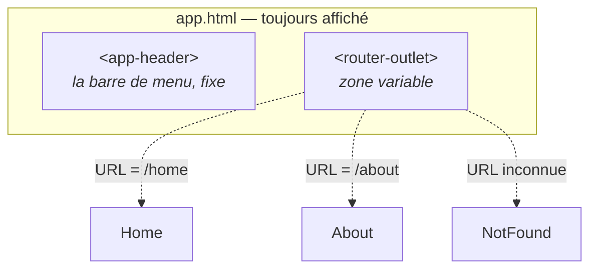

# L2 — Navigation

> 🟠 **Parcours LEGACY** — `NgModule` et RxJS.
> Chapitre équivalent en MODERN : [M2](../MODERN/M2-NAV.md).

**Scénario à réaliser en autonomie.** Vos composants existent mais rien ne les affiche. Vous
allez configurer le routeur dans `AppRoutingModule`, puis construire la barre de menu.
Chapitre **très guidé**.

## ✨ Objectifs

- Comprendre le rôle du routeur et de `<router-outlet>`
- Déclarer des routes dans `AppRoutingModule`, avec redirection et page 404
- Distinguer `forRoot()` et `forChild()`
- Construire une barre de navigation avec Angular Material

## 📁 Point de départ

Le projet du [chapitre 1](L1-SCAFFOLD.md), avec `MaterialModule` et les quatre composants
déclarés dans `AppModule`.

---

## 🧭 1 — Comment fonctionne le routeur

Une application Angular est une **application à page unique** : le navigateur ne charge qu'un
seul document HTML. Quand vous cliquez sur « À propos », rien n'est rechargé — Angular
**remplace un morceau** de l'affichage.



En une phrase : **le routeur lit l'URL, trouve la route correspondante, et affiche le
composant associé à l'emplacement du `<router-outlet>`.** Ce qui est autour ne bouge pas.

---

## 🗺️ 2 — Déclarer les routes

Ouvrez `src/app/app-routing-module.ts`. Le fichier généré contient :

```ts
const routes: Routes = [];

@NgModule({
  imports: [RouterModule.forRoot(routes)],
  exports: [RouterModule],
})
export class AppRoutingModule {}
```

Deux lignes méritent une explication — c'est le point propre à ce parcours :

| Ligne | Rôle |
|---|---|
| `RouterModule.forRoot(routes)` | **Configure** le routeur pour toute l'application. Une seule fois. |
| `exports: [RouterModule]` | Rend `routerLink` et `<router-outlet>` utilisables par `AppModule` |

> ⚠️ **`forRoot()` vs `forChild()`** — vous croiserez les deux.
>
> | Méthode | Où | Ce qu'elle fait |
> |---|---|---|
> | `forRoot(routes)` | **Uniquement** dans `AppRoutingModule` | Crée le service de routage **et** enregistre les routes |
> | `forChild(routes)` | Dans chaque module de fonctionnalité | Ajoute des routes **sans** recréer le service |
>
> Utiliser `forRoot()` deux fois créerait deux routeurs concurrents, et la navigation
> deviendrait erratique. Vous utiliserez `forChild()` au chapitre 3.

### Les routes

Une route associe un chemin à un composant :

| Propriété | Rôle |
|---|---|
| `path` | Le chemin, **sans barre oblique** au début (`'home'`, pas `'/home'`) |
| `component` | Le composant à afficher |
| `redirectTo` | Renvoie ailleurs au lieu d'afficher |
| `pathMatch: 'full'` | Avec `redirectTo` : exige que l'URL entière corresponde |

Deux chemins particuliers : `''` (la racine) et `'**'` (**toute** URL non reconnue, à placer
**en dernier**).

🚧 **À compléter** — `src/app/app-routing-module.ts` :

```ts
import { NgModule } from '@angular/core';
import { RouterModule, Routes } from '@angular/router';
import { Home } from './pages/home/home';
import { About } from './pages/about/about';
import { NotFound } from './pages/not-found/not-found';

const routes: Routes = [
  { path: 'home', component: Home },
  // TODO : une route 'about' qui affiche About

  // TODO : la racine ('') redirige vers 'home' (redirectTo + pathMatch: 'full')

  // TODO : '**' affiche NotFound  /!\ EN DERNIER
];

@NgModule({
  imports: [RouterModule.forRoot(routes)],
  exports: [RouterModule],
})
export class AppRoutingModule {}
```

> 📖 [Définir des routes](https://angular.dev/guide/routing/define-routes)

> ⚠️ **Piège — l'ordre du tableau compte.**
> - *Symptôme :* toutes les pages affichent « 404 », même `/home`.
> - *Cause :* `'**'` est placé avant les autres. Le routeur lit le tableau **de haut en bas** et
>   s'arrête à la première correspondance ; or `'**'` correspond à tout.
> - *Correctif :* déplacer `{ path: '**', ... }` en dernière position.

### Pourquoi `pathMatch: 'full'` ?

Sans cette précision, Angular considère que `''` correspond au **début** de n'importe quelle
URL — donc à toutes. `pathMatch: 'full'` impose une correspondance exacte. Obligatoire dès
qu'on associe une redirection à `''`.

> ⚠️ **Avant de tester, videz `src/app/app.html`.** Le fichier généré contient la longue page
> de démonstration d'Angular ; tant qu'elle est là, vous verrez le logo Angular au lieu de vos
> pages. Remplacez **tout** son contenu par cette seule ligne (le point 4 la complétera) :
>
> ```html
> <router-outlet />
> ```

> 💡 **Tester :** <http://localhost:4200> redirige vers `/home` et affiche « Bienvenue ».
> `/about` fonctionne, et `/nimportequoi` affiche « 404 ».

---

## 🧰 3 — La barre de navigation

Le menu utilise les composants Material que `MaterialModule` exporte déjà. **Rien à importer
dans le composant** : `Header` est déclaré dans `AppModule`, qui importe `MaterialModule`.
C'est tout l'intérêt du module créé au chapitre 1.

### Les liens de navigation

**N'utilisez pas `href`** :

| Écriture | Comportement |
|---|---|
| `<a href="/about">` | Le navigateur **recharge** toute l'application. Lent, état perdu. |
| `<a routerLink="/about">` | Le routeur change la vue **sans recharger** ✅ |

`routerLinkActive="active"` ajoute la classe CSS `active` au lien correspondant à l'URL
courante.

> ℹ️ `routerLink` et `routerLinkActive` sont disponibles ici parce que `AppRoutingModule`
> **exporte** `RouterModule`, et que `AppModule` l'importe. Encore la chaîne du chapitre 1.

🚧 **À compléter** — `src/app/pages/layout/header/header.html` :

```html
<mat-toolbar color="primary">
  <span>My App</span>

  <a matButton routerLink="/home" routerLinkActive="active">Accueil</a>
  <!-- TODO : un lien vers /about, libellé « À propos », sur le même modèle -->

  <span class="spacer"></span>
  <!-- La zone de droite (panier, connexion) viendra aux chapitres 5 et 7. -->
</mat-toolbar>
```

**`src/app/pages/layout/header/header.scss`** :

```scss
.spacer {
  flex: 1 1 auto;
}

.active {
  font-weight: 700;
}
```

> 📖 [RouterLink](https://angular.dev/api/router/RouterLink) ·
> [Barre d'outils Material](https://material.angular.dev/components/toolbar/overview)

---

## 🧩 4 — Assembler l'application

**`src/app/app.html`** — remplacez **tout** le contenu (le fichier généré contient une longue
page de démonstration) par :

```html
<app-header />

<main class="content">
  <router-outlet />
</main>
```

**`src/app/app.scss`** :

```scss
.content {
  padding: 24px;
}
```

Aucune modification du composant `App` n'est nécessaire : `Header` est déjà déclaré dans
`AppModule`, donc utilisable dans le gabarit de tout composant du même module.

> 💡 **Tester :** la barre de menu apparaît en haut et **reste en place** quand vous passez
> d'« Accueil » à « À propos ». Seul le contenu sous la barre change.

> ⚠️ **Piège — `'app-header' is not a known element`.**
> - *Symptôme :* ce message apparaît et le menu ne s'affiche pas.
> - *Cause :* le composant `Header` n'est pas dans les `declarations` d'`AppModule` — typiquement
>   parce que l'option `--m=app` a été oubliée à la génération.
> - *Correctif :* ajoutez `Header` aux `declarations` d'`app-module.ts`, sans oublier la ligne
>   `import` correspondante.

---

## 📊 Comparaison avec le parcours moderne

Vous venez de faire la même chose qu'au chapitre M2, mais autrement :

| | LEGACY (ici) | MODERN |
|---|---|---|
| Où sont les routes | `app-routing-module.ts` (un `NgModule`) | `app.routes.ts` (un simple tableau exporté) |
| Comment le routeur est activé | `RouterModule.forRoot(routes)` | `provideRouter(routes)` dans `app.config.ts` |
| Qui autorise `routerLink` | Le module, via `exports: [RouterModule]` | Chaque composant, via ses `imports` |
| Ce qui change dans le gabarit | **Rien** | **Rien** |

Le gabarit est identique dans les deux cas. Seule la **plomberie** diffère — c'est une bonne
nouvelle : ce que vous apprenez sur les gabarits est valable partout.

---

## 🎉 Challenge final

- [ ] `/home` affiche « Bienvenue », `/about` affiche « À propos »
- [ ] La racine `/` redirige vers `/home`
- [ ] Une URL inventée affiche la page 404
- [ ] La barre de menu est visible sur toutes les pages
- [ ] Cliquer sur un lien ne recharge pas la page
- [ ] Le lien de la page courante est en gras

## ✅ Bonus

- Ajoutez dans `not-found.html` un lien de retour vers l'accueil avec `routerLink`.
  Aucune modification de module n'est nécessaire — sauriez-vous dire pourquoi ?
- Retirez temporairement `exports: [RouterModule]` d'`AppRoutingModule` et observez l'erreur.
  Vous venez de prouver à quoi sert cette ligne.

## Récap

- Le routeur associe une **URL** à un **composant**, affiché à l'emplacement du
  `<router-outlet>`.
- `forRoot()` **une seule fois** dans `AppRoutingModule` ; `forChild()` dans les modules de
  fonctionnalité (chapitre 3).
- `exports: [RouterModule]` rend `routerLink` disponible dans les modules qui l'importent.
- L'ordre des routes compte, et `'**'` se place toujours en dernier.
- `routerLink` navigue sans recharger, contrairement à `href`.

➡️ **Chapitre suivant : [L3 — Feature module et chargement à la demande](L3-PRODUCT-MODULE.md)**
