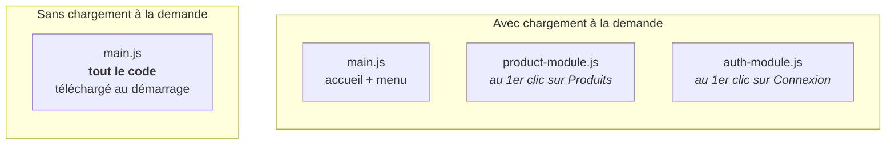

# L3 — Feature module et chargement à la demande

> 🟠 **Parcours LEGACY** — `NgModule` et RxJS.
> Chapitre équivalent en MODERN : [M3](../MODERN/M3-LAZY.md).

**Scénario à réaliser en autonomie.** Vous allez créer un **module de fonctionnalité**
(*feature module*) pour les produits, avec ses propres routes, et faire en sorte que son code
ne soit **téléchargé qu'au moment où l'utilisateur en a besoin**. Chapitre **très guidé**.

## ✨ Objectifs

- Créer un module de fonctionnalité avec son propre routage
- Comprendre `forChild()` et la composition des chemins
- Mettre en place le **chargement à la demande** (*lazy loading*)
- Le **constater** dans l'onglet Réseau du navigateur
- Découvrir le préchargement (aperçu)

## 📁 Point de départ

Le projet du [chapitre 2](L2-NAV.md). À la fin :

```
src/app/modules/product/
├── product-module.ts           le module de fonctionnalité
├── product-routing-module.ts   ses routes
├── pages/product-dashboard/
├── models/product.ts
└── services/product.ts
```

---

## 🧱 1 — Pourquoi un module de fonctionnalité

Jusqu'ici, tout est déclaré dans `AppModule`. Ça marche pour quatre composants. Sur une vraie
application, ce module deviendrait un fichier de deux cents lignes que toute l'équipe modifie
en même temps — et donc un nid à conflits.

On découpe donc **par domaine métier** : un module pour les produits, un pour le panier, un
pour l'authentification. Chacun déclare ses composants et gère ses routes.

L'avantage décisif apparaît à la section 4 : un module bien isolé peut être **chargé
séparément**.

---

## 🏗️ 2 — Générer le module Product

```bash
npx ng g m modules/Product --routing
```

| Option | Rôle |
|---|---|
| `--routing` | Génère **en plus** un `ProductRoutingModule`, pour les routes du module |
| *(pas de `--m=app`)* | **Volontaire** : ce module ne doit PAS être importé dans `AppModule` |

> ⚠️ **Le point le plus important du chapitre.** On omet `--m=app` exprès. Si `AppModule`
> importait `ProductModule`, son code serait inclus dans le fichier principal — et le
> chargement à la demande deviendrait impossible. Le lien se fera **uniquement** par la route,
> à la section 4.

Générez ensuite le contenu du module :

```bash
npx ng g c modules/product/pages/ProductDashboard --m=product --skip-tests
npx ng g i modules/product/models/Product
npx ng g s modules/product/services/Product --skip-tests
```

| Commande | Génère | Rôle |
|---|---|---|
| `ng g c` | un **composant** | Affiche quelque chose |
| `ng g i` | une **interface** | Décrit la *forme* d'une donnée |
| `ng g s` | un **service** | Détient une donnée ou un savoir-faire partagé |
| `--m=product` | — | Déclare le composant dans `ProductModule` (et non dans `AppModule`) |

> ⚠️ **Renommez la classe du service tout de suite.** Le générateur crée
> `services/product.ts` contenant `export class Product` — un nom qui **entre en collision**
> avec l'interface `Product` du modèle. Ouvrez le fichier et renommez la classe en
> **`ProductService`** (gardez le nom de fichier `product.ts`). Vous obtiendrez :
>
> ```ts
> import { Service } from '@angular/core';
>
> @Service()
> export class ProductService {}
> ```
>
> *(`@Service()` est un raccourci d'Angular 22 pour `@Injectable({ providedIn: 'root' })`.)*

> 💡 **Tester :** ouvrez `product-module.ts` : `ProductDashboard` figure dans ses
> `declarations`. C'est l'effet de `--m=product`.

### Le modèle de données

Une interface TypeScript décrit la forme d'un objet. Elle disparaît à la compilation : son
rôle est de permettre au compilateur de vous prévenir en cas d'erreur.

🚧 **À compléter** — `src/app/modules/product/models/product.ts` :

```ts
export interface Product {
  id?: number;        // le ? = facultatif : absent tant que le serveur ne l'a pas attribué
  // TODO : un champ name, de type string
  // TODO : un champ price, de type number
}
```

---

## 🗺️ 3 — Les routes du module

Ouvrez `src/app/modules/product/product-routing-module.ts`.

🚧 **À compléter** :

```ts
import { NgModule } from '@angular/core';
import { RouterModule, Routes } from '@angular/router';
import { ProductDashboard } from './pages/product-dashboard/product-dashboard';

const routes: Routes = [
  // TODO : la route 'dashboard' affiche ProductDashboard
  // TODO : la route '' redirige vers 'dashboard' (pathMatch: 'full')
];

// forChild : routes d'un module de fonctionnalité.
// forRoot est réservé à AppRoutingModule (voir chapitre 2).
@NgModule({
  imports: [RouterModule.forChild(routes)],
  exports: [RouterModule],
})
export class ProductRoutingModule {}
```

Ces chemins sont **relatifs**. Branchés sous `/products` à l'étape suivante, ils donneront :

| Route déclarée ici | URL finale |
|---|---|
| `'dashboard'` | `/products/dashboard` |
| `''` (redirection) | `/products` => redirigé vers `/products/dashboard` |

### Le module Material dans le module Product

`ProductDashboard` utilisera des composants Material. Mais il est déclaré dans
`ProductModule`, pas dans `AppModule` — il ne bénéficie donc **pas** du `MaterialModule`
importé par ce dernier.

> ⚠️ **Les imports d'un module ne se transmettent pas à ses enfants.** C'est la source
> d'erreur numéro un de ce parcours. Chaque module qui utilise Material doit importer
> `MaterialModule` **lui-même**.

🚧 **À compléter** — `src/app/modules/product/product-module.ts` :

```ts
import { NgModule } from '@angular/core';
import { CommonModule } from '@angular/common';
import { ProductRoutingModule } from './product-routing-module';
// TODO : importer MaterialModule depuis '../../material-module'
import { ProductDashboard } from './pages/product-dashboard/product-dashboard';

@NgModule({
  declarations: [ProductDashboard],
  // TODO : ajouter MaterialModule aux imports
  imports: [CommonModule, ProductRoutingModule],
})
export class ProductModule {}
```

> ℹ️ **`CommonModule`** fournit les directives de base (`NgIf`, `NgFor`, les pipes `date`,
> `currency`…). `AppModule` les obtient via `BrowserModule` ; tout autre module doit importer
> `CommonModule`. Le générateur l'ajoute automatiquement.

---

## ⚡ 4 — Le chargement à la demande

Voici le cœur du chapitre.

**Le problème.** Par défaut, tout le code est empaqueté dans un seul fichier JavaScript,
téléchargé au premier affichage. Un visiteur qui ne consulte que l'accueil télécharge quand
même le code des produits, du panier, de l'administration…

**La solution.** Mettre le code d'un module dans un fichier **séparé**, téléchargé seulement
quand l'utilisateur visite l'URL correspondante.



Tout se joue sur **une propriété** : au lieu de `component`, on écrit `loadChildren`.

| Propriété | Comportement |
|---|---|
| `component: X` | Le composant est inclus dans le fichier principal |
| `loadChildren: () => import(…)` | Le code est mis à part, téléchargé **au premier accès** |

La valeur de `loadChildren` est une **fonction** — c'est ce détail qui fait tout. Angular ne
l'appelle qu'au moment voulu ; tant qu'elle n'est pas appelée, le `import()` ne se déclenche
pas et le fichier n'est pas téléchargé.

🚧 **À compléter** — `src/app/app-routing-module.ts` :

```ts
const routes: Routes = [
  { path: 'home', component: Home },
  { path: 'about', component: About },

  // TODO : la route 'products' charge ProductModule à la demande.
  //        Modèle à compléter :
  // {
  //   path: 'products',
  //   loadChildren: () => import('./modules/product/product-module')
  //                         .then((m) => m.ProductModule),
  // },

  { path: '', redirectTo: 'home', pathMatch: 'full' },
  { path: '**', component: NotFound },
];
```

Ajoutez le lien dans le menu — `header.html`, après « Accueil » :

```html
<a matButton routerLink="/products" routerLinkActive="active">Produits</a>
```

> 📖 [Chargement à la demande](https://angular.dev/guide/routing/define-routes#lazily-loaded-routes)

> ⚠️ **Piège — importer le module dans `AppModule`.**
> - *Symptôme :* le chargement à la demande « ne marche pas » : aucun fichier séparé n'apparaît.
> - *Cause :* `ProductModule` figure dans les `imports` d'`AppModule` — souvent parce que
>   `--m=app` a été utilisé par réflexe à la génération. Cet import **statique** force
>   l'inclusion dans le fichier principal.
> - *Correctif :* retirer `ProductModule` des `imports` d'`AppModule` **et** la ligne `import`
>   en haut du fichier. Le lien doit se faire **uniquement** par `loadChildren`.

---

## 🔬 5 — Constater le chargement à la demande

### a. Dans les journaux du build

Arrêtez le serveur, relancez `npm start` et lisez la sortie :

```
Initial chunk files | Names          |  Raw size
main-PBYEYTK4.js    | main           |   3.95 kB

Lazy chunk files    | Names          |  Raw size
chunk-INMGJMJ5.js   | product-module |   5.05 kB
```

La section **`Lazy chunk files`** est la preuve : `product-module` est dans un fichier à part.

### b. Dans le navigateur

> **🧪 Manip — voir le fichier arriver**
>
> 1. Ouvrez <http://localhost:4200/home>
> 2. Ouvrez les outils de développement (`F12`), onglet **Réseau** (*Network*)
> 3. Cochez **Conserver le journal** (*Preserve log*) et filtrez sur **JS**
> 4. Rechargez, puis **cliquez sur « Produits »**
>
> *Observé : au clic, une nouvelle ligne apparaît — le fichier correspondant à
> `product-module`. Il n'avait pas été téléchargé au démarrage.*


Recliquez sur « Accueil » puis « Produits » : aucun nouveau téléchargement. Le coût n'est payé
**qu'une fois**.

---

## 🌉 Ouverture — le préchargement

Le chargement à la demande a une contrepartie : au **premier** clic, l'utilisateur attend. Sur
une connexion lente, cela se voit.

D'où le **préchargement** : Angular affiche d'abord l'accueil, puis télécharge **en
arrière-plan** les modules non encore visités. Le clic devient instantané sans alourdir le
démarrage.

Une ligne suffit — dans `app-routing-module.ts` :

```ts
import { RouterModule, Routes, PreloadAllModules } from '@angular/router';

@NgModule({
  imports: [RouterModule.forRoot(routes, { preloadingStrategy: PreloadAllModules })],
  exports: [RouterModule],
})
```

Refaites la manip : le fichier arrive désormais **quelques instants après** le chargement de
l'accueil, sans que vous ayez cliqué.

| Stratégie | Quand le code est téléchargé |
|---|---|
| Aucune (défaut) | Au premier accès à la route |
| `PreloadAllModules` | En arrière-plan, dès que l'application est au repos |
| Sur mesure | Selon vos propres critères |

> 📖 [Stratégies de chargement](https://angular.dev/guide/routing/loading-strategies)
>
> ℹ️ Cet encart est un **aperçu** : libre à vous de laisser le préchargement activé ou non.

---

## 🎉 Challenge final

- [ ] `modules/product/` contient le module, son routage, la page, le modèle et le service
- [ ] `ProductModule` importe `MaterialModule` **et** `ProductRoutingModule`
- [ ] `ProductModule` n'est **pas** importé dans `AppModule`
- [ ] `/products` redirige vers `/products/dashboard`
- [ ] Les journaux du build montrent `product-module` dans **`Lazy chunk files`**
- [ ] L'onglet Réseau montre le fichier arrivant **au clic**

## ✅ Bonus

- Créez un module `CartModule` sur le même modèle, chargé à la demande sous `/cart` :
  ```bash
  npx ng g m modules/Cart --routing
  npx ng g c modules/cart/Cart --m=cart --inline-style --inline-template --flat --skip-tests
  ```
  *(`--flat --inline-*` crée un composant en un seul fichier.)* Vérifiez qu'un **deuxième**
  fichier apparaît dans `Lazy chunk files`.

## Récap

- Un **module de fonctionnalité** regroupe les composants d'un domaine et gère ses routes.
- `forChild()` dans un module de fonctionnalité ; `forRoot()` **uniquement** dans
  `AppRoutingModule`.
- Les imports d'un module **ne se transmettent pas** : chaque module qui utilise Material doit
  importer `MaterialModule`.
- `loadChildren: () => import(...)` met le code à part ; un import statique dans `AppModule`
  **annule** le bénéfice.
- Le **préchargement** offre un compromis : démarrage léger, clic instantané.

---

## 🛑 Debrief 1

1. Où le composant associé à une route est-il affiché ?
2. Quelle différence entre `forRoot()` et `forChild()` ?
3. Pourquoi `ProductModule` ne doit-il **pas** être importé dans `AppModule` ?
4. Comment prouver, sans faire confiance à personne, que le chargement à la demande
   fonctionne ?

➡️ **Chapitre suivant : [L4 — Interface graphique](L4-UI.md)**
