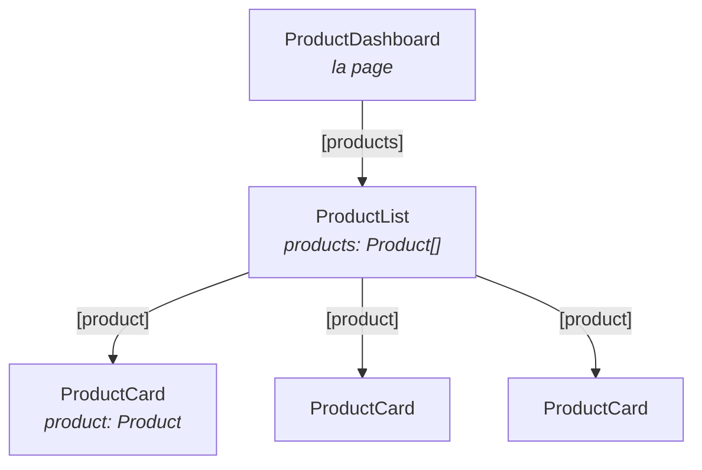

# L4 — Interface graphique

> 🟠 **Parcours LEGACY** — `NgModule` et RxJS.
> Chapitre équivalent en MODERN : [M4](../MODERN/M4-UI.md).

**Scénario à réaliser en autonomie.** Vous allez découper la page produits en trois
composants et faire descendre une donnée du parent vers l'enfant. Le guidage s'allège : vous
complétez des `TODO` en vous appuyant sur les tableaux et les liens de documentation.

## ✨ Objectifs

- Découper une page en composants réutilisables
- Faire passer une donnée du parent vers l'enfant avec `@Input()`
- Afficher une liste avec `@for`
- Comprendre ce que le module doit déclarer pour que tout fonctionne

## 📁 Point de départ

Le projet du [chapitre 3](L3-PRODUCT-MODULE.md), avec `ProductModule` chargé à la demande.

---

## 🧩 1 — Le découpage

Une règle simple, valable bien au-delà d'Angular : **un composant, une responsabilité.**

| Composant | Responsabilité | Ce qu'il ignore |
|---|---|---|
| `ProductDashboard` | La **page** : assemble les morceaux | Comment une carte est dessinée |
| `ProductList` | Afficher **N** produits | D'où vient la liste |
| `ProductCard` | Afficher **1** produit | Qu'il existe une liste |

Chaque composant ignore le contexte de celui qui l'utilise : c'est ce qui le rend réutilisable.



Générez les deux composants — **sans oublier `--m=product`** :

```bash
npx ng g c modules/product/components/ProductCard --m=product --skip-tests
npx ng g c modules/product/components/ProductList --m=product --skip-tests
```

> ℹ️ `--m=product` les déclare dans `ProductModule`. Sans cette option, ils atterriraient dans
> `AppModule` et ne seraient **pas** utilisables depuis la page produits — vous obtiendriez
> `'app-product-card' is not a known element`.

---

## 📥 2 — Faire descendre une donnée : `@Input()`

Pour qu'un parent transmette une valeur à son enfant, l'enfant déclare une **entrée** :

```ts
@Input({ required: true }) product!: Product;
```

| Écriture | Signification |
|---|---|
| `@Input() x?: T;` | Entrée **facultative** |
| `@Input() x: T = valeur;` | Entrée facultative avec valeur par défaut |
| `@Input({ required: true }) x!: T;` | Entrée **obligatoire** : le compilateur refuse si le parent l'oublie |

> ℹ️ Le `!` après le nom (`product!`) dit à TypeScript : « cette valeur sera fournie, ne
> t'inquiète pas qu'elle ne soit pas initialisée ici ». Sans lui, le mode strict proteste.

Le parent transmet par une **liaison de propriété**, entre crochets :

```html
<app-product-card [product]="unProduit" />
```

> ⚠️ **Les crochets ne sont pas décoratifs.**
>
> | Écriture | Ce qui est transmis |
> |---|---|
> | `[product]="unProduit"` | La **valeur** de la variable |
> | `product="unProduit"` | La **chaîne de caractères** `"unProduit"` 😱 |

> 📖 [Entrées d'un composant](https://angular.dev/guide/components/inputs)

---

## 🃏 3 — Le composant `ProductCard`

La carte affiche un produit avec le composant
[Card de Material](https://material.angular.dev/components/card/overview).

🚧 **À compléter** — `product-card.ts` :

```ts
import { Component, Input } from '@angular/core';
import { Product } from '../../models/product';

@Component({
  selector: 'app-product-card',
  standalone: false,
  templateUrl: './product-card.html',
  styleUrl: './product-card.scss',
})
export class ProductCard {
  // TODO : déclarer une entrée OBLIGATOIRE nommée product, de type Product
}
```

Notez l'absence de tableau `imports` : **c'est `ProductModule` qui fournit Material** (vous
l'y avez ajouté au chapitre 3). Le composant, lui, ne déclare rien.

🚧 **À compléter** — `product-card.html` :

```html
<mat-card class="product-card">
  <mat-card-header>
    <mat-card-title>{{ product.name }}</mat-card-title>
    <!-- TODO : afficher le prix dans un <mat-card-subtitle>, suivi de « € » -->
  </mat-card-header>
  <mat-card-actions>
    <button matButton>BUY</button>
  </mat-card-actions>
</mat-card>
```

**`product-card.scss`** :

```scss
.product-card {
  width: 220px;
}
```

> ℹ️ `{{ ... }}` est l'**interpolation** : Angular évalue l'expression et insère le résultat.
> Remarquez `product.name`, **sans parenthèses** — contrairement au parcours moderne où
> `@Input()` est remplacé par un signal qui se lit avec `()`.

---

## 📋 4 — Le composant `ProductList` et la boucle `@for`

```html
@for (product of products; track product.name) {
  <app-product-card [product]="product" />
}
```

| Élément | Rôle |
|---|---|
| `product of products` | Parcourt la liste ; `product` est la variable de boucle |
| `track product.name` | **Obligatoire.** Identifie chaque élément de façon unique |
| `@empty { … }` | Bloc affiché si la liste est vide |

### Pourquoi `track` est obligatoire

Quand la liste change, Angular doit savoir quels éléments sont *les mêmes* qu'avant, pour ne
redessiner que ce qui bouge. Sans `track`, il détruirait et recréerait tout — au mieux lent,
au pire vous perdez le focus d'un champ en cours de saisie.

On utilise normalement un identifiant unique (`track product.id`). Nos produits n'en ont pas
encore — il viendra du serveur au chapitre 6 — donc `track product.name` fera l'affaire.

🚧 **À compléter** — `product-list.ts` :

```ts
import { Component, Input } from '@angular/core';
import { Product } from '../../models/product';

@Component({
  selector: 'app-product-list',
  standalone: false,
  templateUrl: './product-list.html',
  styleUrl: './product-list.scss',
})
export class ProductList {
  // TODO : une entrée products, de type Product[], initialisée à []
}
```

🚧 **À compléter** — `product-list.html` :

```html
<div class="product-list">
  <!-- TODO : une boucle @for sur products, qui affiche un <app-product-card>
       par produit, en lui passant le produit via [product]
       Ajoutez un bloc @empty affichant « Aucun produit pour l'instant. » -->
</div>
```

**`product-list.scss`** :

```scss
.product-list {
  display: flex;
  flex-wrap: wrap;
  gap: 16px;
}
```

> 📖 [La boucle @for](https://angular.dev/guide/templates/control-flow#repeat-content-with-the-for-block)
>
> ℹ️ **Dans un projet plus ancien**, vous verrez `*ngFor="let p of products"`. Même rôle ;
> `@for` l'a remplacée depuis Angular 17. Avantage notable : `@for` **ne nécessite aucun
> import**, là où `*ngFor` exigeait `CommonModule`.

---

## 🖼️ 5 — Assembler dans la page

Pour l'instant, la liste est écrite en dur — elle viendra du serveur au chapitre 6.

🚧 **À compléter** — `product-dashboard.ts` :

```ts
import { Component } from '@angular/core';
import { Product } from '../../models/product';

@Component({
  selector: 'app-product-dashboard',
  standalone: false,
  templateUrl: './product-dashboard.html',
  styleUrl: './product-dashboard.scss',
})
export class ProductDashboard {
  products: Product[] = [
    { name: 'Clavier mécanique', price: 89 },
    { name: 'Souris ergonomique', price: 45 },
    // TODO : ajoutez un troisième produit
  ];
}
```

🚧 **À compléter** — `product-dashboard.html` :

```html
<h1>Nos produits</h1>

<!-- TODO : afficher <app-product-list>, en lui passant la liste via [products] -->
```

> 💡 **Tester :** rendez-vous sur <http://localhost:4200/products>. Trois cartes s'affichent
> côte à côte, avec nom et prix. Le bouton BUY ne fait rien encore — chapitre 5.

---

## 🧪 Manip — l'erreur de module, en vrai

L'erreur la plus fréquente de ce parcours mérite d'être provoquée une fois, pour être
reconnue ensuite en deux secondes.

1. Dans `product-module.ts`, **retirez temporairement** `MaterialModule` des `imports`.
2. Rechargez `/products`.

*Observé :*
```
NG0304: 'mat-card' is not a known element
```

3. Remettez `MaterialModule`. L'erreur disparaît.

<details>
<summary>Le raisonnement à appliquer face à un NG0304</summary>

Le message dit toujours *dans quel composant* l'élément inconnu se trouve. Posez-vous alors
trois questions, dans l'ordre :

1. **Dans quel module ce composant est-il déclaré ?** (cherchez-le dans les `declarations`)
2. **Ce module importe-t-il ce qu'il faut ?** Pour du Material : `MaterialModule`.
3. Si l'élément inconnu est **un de vos composants** : est-il bien dans les `declarations` du
   même module, ou `exports` du module voisin ?

En LEGACY, la réponse est **toujours** dans un module — jamais dans le composant.

</details>

---

## 📊 Comparaison avec le parcours moderne

| | LEGACY (ici) | MODERN |
|---|---|---|
| Déclarer une entrée | `@Input() product!: Product;` | `product = input.required<Product>()` |
| Lire dans le gabarit | `product.name` | `product().name` |
| Rendre Material disponible | `ProductModule` importe `MaterialModule` | Chaque composant le déclare dans ses `imports` |
| Le gabarit lui-même | **Identique** | **Identique** |

La différence de fond : en LEGACY, le module **centralise** les dépendances de tous ses
composants. C'est plus concis quand ils partagent les mêmes besoins, mais on perd de vue ce
que chaque composant utilise réellement — c'est précisément ce que l'approche moderne corrige.

---

## 🎉 Challenge final

- [ ] `/products` affiche trois cartes Material, côte à côte
- [ ] Chaque carte montre le nom et le prix de son produit
- [ ] `ProductCard` ne connaît **qu'un** produit
- [ ] Vider la liste fait apparaître le message du bloc `@empty`
- [ ] Les trois composants sont déclarés dans `ProductModule`, pas dans `AppModule`
- [ ] Vous savez quoi faire face à un `NG0304`

## ✅ Bonus

- Ajoutez au `ProductCard` une entrée facultative `currency` valant `'€'` par défaut.
- Affichez le prix avec le *pipe* `currency` :
  `{{ product.price | currency:'EUR' }}`. Il vient de `CommonModule`, déjà importé par
  `ProductModule` — rien à ajouter. ([doc](https://angular.dev/api/common/CurrencyPipe))

## Récap

- Un composant, une responsabilité : la page assemble, la liste répète, la carte affiche.
- `@Input()` déclare une entrée ; `{ required: true }` la rend obligatoire.
- Le parent transmet avec **`[propriete]="valeur"`** — les crochets sont indispensables.
- `@for` répète un bloc et exige `track`.
- Face à un `NG0304`, la réponse est **toujours** dans un module.

---

## 🛑 Debrief 2

1. Pourquoi découper en trois composants plutôt qu'écrire toute la page d'un bloc ?
2. Quelle différence entre `[product]="p"` et `product="p"` ?
3. Pourquoi `track` est-il obligatoire dans `@for` ?
4. Un `NG0304` apparaît : quelles questions vous posez-vous, dans quel ordre ?

---

➡️ **Chapitre suivant : [L5 — Formulaires et interactions](L5-FORMS-INTERACTIONS.md)**
