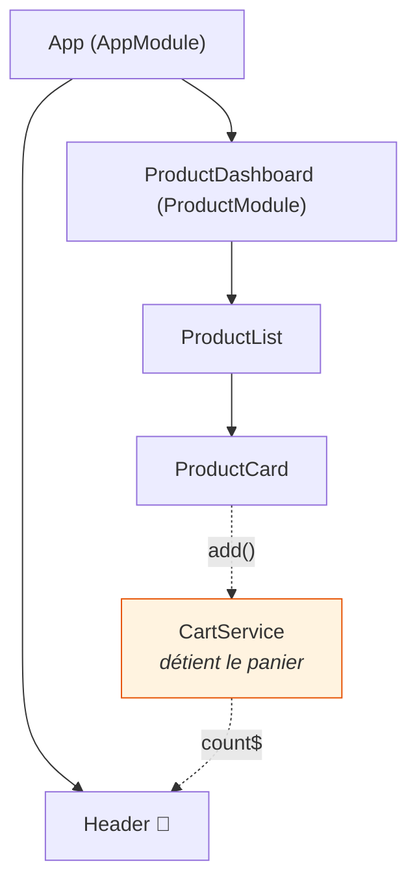
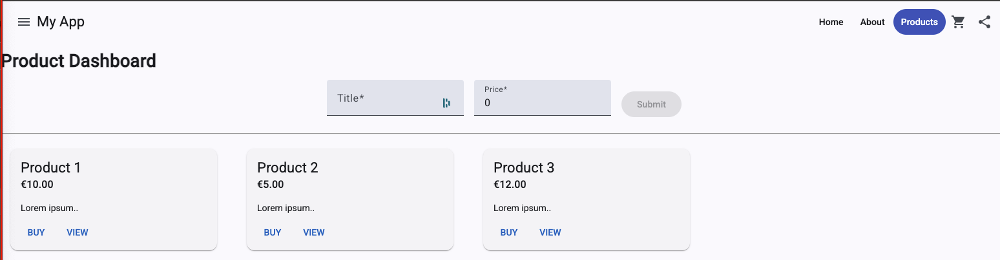

# L5 — Formulaires et interactions

> 🟠 **Parcours LEGACY** — `NgModule` et RxJS.
> Chapitre équivalent en MODERN : [M5](../MODERN/M5-FORMS-INTERACTIONS.md).

**Scénario à réaliser en autonomie.** Vous allez saisir un produit dans un formulaire, le
faire remonter jusqu'à la page, puis le mettre au panier — et voir le compteur du menu
s'incrémenter. Guidage en **codes à trou**.

## ✨ Objectifs

- Connaître les façons de faire un formulaire, et savoir laquelle choisir
- Faire remonter une donnée de l'enfant vers le parent avec `@Output()`
- Partager un état entre deux composants éloignés grâce à un **service**
- Découvrir `BehaviorSubject` et le pipe `async`

## 📁 Point de départ

Le projet du [chapitre 4](L4-UI.md), avec la liste de cartes affichée.

---

## 📝 1 — Deux façons de faire un formulaire

Angular en propose deux (une troisième, les *formulaires à signaux*, existe mais vise les
projets modernes — voir [M5](../MODERN/M5-FORMS-INTERACTIONS.md#-1--trois-façons-de-faire-un-formulaire)).

### Niveau 1 — Le formulaire par gabarit (*template-driven*)

Tout se passe dans le HTML, avec `[(ngModel)]` :

```html
<input [(ngModel)]="name" name="name" />
```

Cette syntaxe `[( )]`, surnommée *banana in a box*, combine les deux liaisons : `[ ]` fait
descendre la valeur, `( )` fait remonter la modification. Simple et direct.

**Sa limite :** la validation devient vite illisible dès que les règles se croisent, et le
TypeScript n'a pas de vision d'ensemble du formulaire. *(Nécessite `FormsModule`.)*

### Niveau 2 — Le formulaire réactif typé (*reactive forms*)

Le formulaire est décrit **en TypeScript** :

```ts
form = new FormGroup({
  name: new FormControl('', { nonNullable: true, validators: [Validators.required] }),
});
```

L'objet `form` devient la source de vérité : on peut l'interroger, le valider, l'observer. Et
parce qu'il est **typé**, l'éditeur connaît le type de chaque champ.

**C'est le choix de ce lab**, et de l'immense majorité des projets.

| | Niveau 1 — gabarit | Niveau 2 — réactif typé |
|---|---|---|
| Où est décrit le formulaire | Dans le HTML | En TypeScript |
| Typage | Faible | **Fort** |
| Validation complexe | Pénible | Confortable |
| Module à importer | `FormsModule` | `ReactiveFormsModule` |
| À choisir pour | Un formulaire de 1-2 champs | **La plupart des cas** |

> 📖 [Formulaires réactifs](https://angular.dev/guide/forms/reactive-forms) ·
> [Formulaires par gabarit](https://angular.dev/guide/forms/template-driven-forms)

---

## 📤 2 — Faire remonter une donnée : `@Output()`

Au chapitre 4, `@Input()` faisait **descendre** une donnée. Pour la faire **remonter**, on
utilise `@Output()` avec un `EventEmitter` :

```ts
@Output() add = new EventEmitter<Product>();   // déclaration dans l'enfant
this.add.emit(unProduit);                      // émission
```

Le parent écoute avec des parenthèses — comme un `(click)` :

```html
<app-product-form (add)="onAdd($event)" />
```

`$event` est une variable fournie par Angular : elle contient la valeur émise.

| Sens | Écriture | Mot-clé |
|---|---|---|
| Parent ➡ enfant | `[product]="p"` | `@Input()` |
| Enfant ➡ parent | `(add)="onAdd($event)"` | `@Output()` |

> 📖 [Sorties d'un composant](https://angular.dev/guide/components/outputs)

---

## ✍️ 3 — Le formulaire produit

```bash
npx ng g c modules/product/components/ProductForm --m=product --skip-tests
```

Les formulaires réactifs exigent un module. **Il s'importe dans `ProductModule`**, pas dans le
composant :

🚧 **À compléter** — `product-module.ts` :

```ts
import { ReactiveFormsModule } from '@angular/forms';

@NgModule({
  declarations: [ProductDashboard, ProductList, ProductCard, ProductForm],
  // TODO : ajouter ReactiveFormsModule aux imports
  imports: [CommonModule, ProductRoutingModule, MaterialModule],
})
```

Les classes à connaître :

| Classe | Rôle |
|---|---|
| `FormGroup` | Un groupe de champs — le formulaire entier |
| `FormControl` | Un champ individuel |
| `Validators` | Les règles (`required`, `min`, `email`…) |
| `nonNullable: true` | Le champ ne peut pas valoir `null` ; le typage est plus strict |

🚧 **À compléter** — `product-form.ts` :

```ts
import { Component, EventEmitter, Output } from '@angular/core';
import { FormControl, FormGroup, Validators } from '@angular/forms';
import { Product } from '../../models/product';

@Component({
  selector: 'app-product-form',
  standalone: false,
  templateUrl: './product-form.html',
  styleUrl: './product-form.scss',
})
export class ProductForm {
  // TODO : déclarer une sortie nommée add, qui émettra un Product

  form = new FormGroup({
    name: new FormControl('', { nonNullable: true, validators: [Validators.required] }),
    // TODO : un champ price, initialisé à 0, avec Validators.min(0)
  });

  onSubmit(): void {
    if (this.form.invalid) {
      return;                      // on n'émet rien si la saisie est invalide
    }
    // TODO : émettre this.form.getRawValue() via la sortie add
    this.form.reset();
  }
}
```

🚧 **À compléter** — `product-form.html` :

```html
<form class="product-form" [formGroup]="form" (ngSubmit)="onSubmit()">
  <mat-form-field>
    <mat-label>Nom</mat-label>
    <input matInput formControlName="name" />
  </mat-form-field>

  <!-- TODO : le même bloc pour le prix, avec type="number" et formControlName="price" -->

  <button matButton="filled" type="submit" [disabled]="form.invalid">Ajouter</button>
</form>
```

**`product-form.scss`** :

```scss
.product-form {
  display: flex;
  align-items: center;
  gap: 16px;
}
```

| Attribut | Rôle |
|---|---|
| `[formGroup]="form"` | Relie le `<form>` à votre objet `form` |
| `formControlName="name"` | Relie ce champ à la clé `name` du `FormGroup` |
| `(ngSubmit)` | Se déclenche à la soumission — clic **et** touche Entrée |

> ⚠️ **Piège — `ReactiveFormsModule` oublié.**
> - *Symptôme :* `Can't bind to 'formGroup' since it isn't a known property of 'form'`.
> - *Cause :* `ReactiveFormsModule` manque dans les `imports` du **module** qui déclare le
>   composant.
> - *Correctif :* l'ajouter à `ProductModule`. Réflexe LEGACY : l'erreur est dans le module.

---

## 🔗 4 — Brancher le formulaire sur la page

🚧 **À compléter** — `product-dashboard.ts` :

```ts
export class ProductDashboard {
  products: Product[] = [
    { name: 'Clavier mécanique', price: 89 },
    { name: 'Souris ergonomique', price: 45 },
    { name: 'Écran 27 pouces', price: 249 },
  ];

  onAdd(product: Product): void {
    // TODO : ajouter le produit à la liste.
    //        Préférez créer un nouveau tableau : this.products = [...this.products, product];
  }
}
```

🚧 **À compléter** — `product-dashboard.html` :

```html
<h1>Nos produits</h1>

<!-- TODO : afficher <app-product-form> et écouter sa sortie (add) -->

<app-product-list [products]="products" />
```

> 💡 **Tester :** saisissez « Souris sans fil » / `25`, cliquez sur **Ajouter**. Une quatrième
> carte apparaît, et le formulaire se vide.

> ℹ️ **`push()` ou nouveau tableau ?** Ici, `this.products.push(product)` fonctionnerait :
> ce parcours utilise `zone.js`, qui détecte les changements automatiquement. On préfère
> malgré tout créer un nouveau tableau — c'est plus sûr (compatible avec les stratégies de
> détection optimisées comme `OnPush`) et c'est l'habitude à prendre.

---

## 🛒 5 — Le panier : partager un état entre composants éloignés

Nouveau besoin : cliquer sur **BUY** doit incrémenter un compteur **dans le menu**.

Le problème est structurel. `ProductCard` et `Header` ne sont ni parents ni enfants l'un de
l'autre — ils vivent dans des branches séparées, et même dans des **modules différents**.
Aucune combinaison d'`@Input()` et d'`@Output()` ne peut raisonnablement les relier.



**La solution : un service.** Une classe qui détient l'état, injectable partout.

```bash
npx ng g s modules/cart/services/Cart --skip-tests
```

### `BehaviorSubject` : une valeur qui se diffuse

En LEGACY, on utilise RxJS pour partager un état qui évolue. L'outil adapté est le
`BehaviorSubject` :

| | `Subject` | `BehaviorSubject` |
|---|---|---|
| Valeur initiale | Aucune | **Obligatoire** |
| Un nouvel abonné reçoit… | Rien, jusqu'à la prochaine émission | **La dernière valeur, immédiatement** |

C'est ce second comportement qu'il nous faut : le `Header` peut s'abonner à n'importe quel
moment, il recevra tout de suite l'état courant du panier.

| Méthode | Rôle |
|---|---|
| `.next(valeur)` | Émet une nouvelle valeur |
| `.value` | Lit la valeur courante, de façon synchrone |
| `.asObservable()` | Expose une version **lecture seule** |
| `.pipe(map(...))` | Dérive une nouvelle valeur |

🚧 **À compléter** — `src/app/modules/cart/services/cart.ts` :

```ts
import { Injectable } from '@angular/core';
import { BehaviorSubject, Observable, map } from 'rxjs';
import { Product } from '../../product/models/product';

@Injectable({ providedIn: 'root' })
export class CartService {
  /** BehaviorSubject : conserve la dernière valeur et la rejoue aux nouveaux abonnés. */
  private readonly items = new BehaviorSubject<Product[]>([]);

  // TODO : exposer count$, un Observable<number> qui vaut le nombre d'articles.
  //        Piste : this.items.pipe(map((list) => list.length))

  add(product: Product): void {
    // TODO : émettre un NOUVEAU tableau contenant l'ancien + le produit
    //        Piste : this.items.next([...this.items.value, product]);
  }
}
```

| Élément | Rôle |
|---|---|
| `@Injectable({ providedIn: 'root' })` | Rend le service disponible partout, en **un seul exemplaire** |
| `private readonly items` | L'état interne : personne ne le modifie de l'extérieur |
| `count$` | Le `$` final est une convention : « cette variable est un observable » |

> ℹ️ **Un seul exemplaire, c'est essentiel.** Avec `providedIn: 'root'`, tous les composants
> reçoivent **la même instance** — même s'ils vivent dans des modules différents. Sans cela,
> la carte remplirait un panier et le menu en lirait un autre.

---

## 🔌 6 — Brancher le panier

**a. `ProductCard`** — ajoutez une sortie et émettez au clic :

```ts
@Output() buy = new EventEmitter<Product>();
```
```html
<button matButton (click)="buy.emit(product)">BUY</button>
```

**b. `ProductList`** — la liste **relaie** l'événement vers le haut :

```ts
@Output() buy = new EventEmitter<Product>();
```
```html
<app-product-card [product]="product" (buy)="buy.emit($event)" />
```

**c. `ProductDashboard`** — écoutez et transmettez au service.

🚧 **À compléter** :

```ts
import { CartService } from '../../../cart/services/cart';

export class ProductDashboard {
  // En LEGACY, on injecte par le CONSTRUCTEUR.
  constructor(private cartService: CartService) {}

  onBuy(product: Product): void {
    // TODO : appeler la méthode add du service
  }
}
```
```html
<app-product-list [products]="products" (buy)="onBuy($event)" />
```

> ℹ️ **L'injection par constructeur** est la forme historique : on déclare le paramètre avec
> `private`, et Angular fournit l'instance. Le parcours moderne utilise `inject()` — même
> mécanisme, écriture différente. Les deux fonctionnent en Angular 22.

**d. `Header`** — affichez le compteur avec le pipe `async`.

🚧 **À compléter** — `header.ts` :

```ts
import { Component } from '@angular/core';
import { Observable } from 'rxjs';
import { CartService } from '../../../modules/cart/services/cart';

export class Header {
  // TODO : déclarer count$, de type Observable<number>
  readonly count$: Observable<number>;

  constructor(private cart: CartService) {
    // TODO : l'initialiser avec this.cart.count$
  }
}
```

`header.html` — après le `.spacer` :

```html
<button matIconButton aria-label="Panier">
  <mat-icon [matBadge]="count$ | async" matBadgeColor="warn">shopping_cart</mat-icon>
</button>
```

### Le pipe `async`

C'est la pièce maîtresse du parcours LEGACY :

```html
{{ count$ | async }}
```

| Sans le pipe `async` | Avec |
|---|---|
| `subscribe()` dans `ngOnInit` | Rien à écrire |
| Stocker la valeur dans une propriété | Rien à stocker |
| **`unsubscribe()` dans `ngOnDestroy`** | Angular s'en charge |

Ce dernier point est décisif : un abonnement oublié continue de tourner après la destruction
du composant — c'est une fuite mémoire classique. Le pipe `async` se désabonne tout seul.

> 📖 [AsyncPipe](https://angular.dev/api/common/AsyncPipe)
>
> ℹ️ `AsyncPipe` vient de `CommonModule`. `AppModule` l'obtient via `BrowserModule` : rien à
> ajouter ici.

> 💡 **Tester :** cliquez sur BUY. La pastille passe de 0 à 1, puis 2, 3… Le compteur est dans
> le menu, le clic dans une carte, et ils appartiennent à deux modules différents : le service
> les relie.



---

## 🎉 Challenge final

- [ ] Le formulaire ajoute un produit à la liste, puis se vide
- [ ] Le bouton **Ajouter** est désactivé tant que le nom est vide
- [ ] Cliquer sur BUY incrémente la pastille du menu
- [ ] `ProductCard` ne connaît **ni** la liste **ni** le panier
- [ ] Vous savez expliquer ce que fait le pipe `async`

## ✅ Bonus

- Ajoutez un bouton « Vider le panier » appelant une méthode `clear()` du service. La pastille
  revient à 0 — sans que vous ayez touché au compteur : `map()` s'en charge.
- Affichez un message d'erreur sous le champ Nom :
  ```html
  @if (form.controls.name.touched && form.controls.name.invalid) {
    <mat-error>Le nom est obligatoire.</mat-error>
  }
  ```
- **Comparez** : ouvrez [M5](../MODERN/M5-FORMS-INTERACTIONS.md) et regardez le même
  `CartService` écrit avec des signaux. Lequel trouvez-vous le plus lisible ?

## Récap

- Le formulaire **réactif typé** est le standard actuel ; `ReactiveFormsModule` s'importe dans
  le **module**.
- `@Output()` + `EventEmitter` font remonter une donnée ; le parent écoute avec
  `(nom)="methode($event)"`.
- Pour relier deux composants **éloignés**, on passe par un **service** partagé.
- `BehaviorSubject` conserve la dernière valeur et la rejoue aux nouveaux abonnés.
- Le pipe **`async`** s'abonne et **se désabonne** tout seul : il évite les fuites mémoire.

➡️ **Chapitre suivant : [L6 — Requêtes HTTP](L6-HTTP.md)**

---

## 🛑 Debrief 3

1. `@Input()` et `@Output()` : lequel descend, lequel remonte ?
2. Pourquoi ne peut-on pas relier `ProductCard` et `Header` par des entrées/sorties ?
3. Pourquoi un `BehaviorSubject` plutôt qu'un `Subject` ?
4. Que fait le pipe `async`, et quel problème évite-t-il ?
