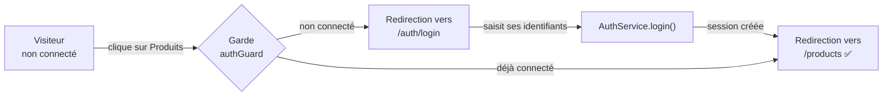
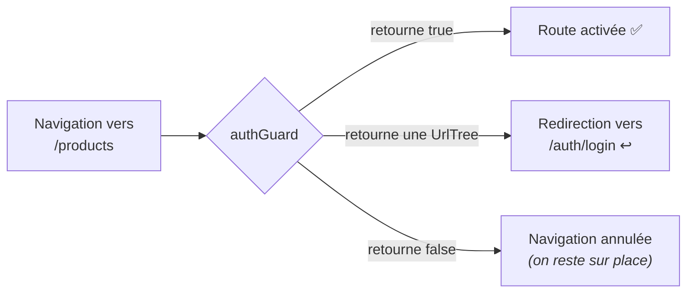

# L7 — Authentification et garde de route

> 🟠 **Parcours LEGACY** — `NgModule` et RxJS.
> Chapitre équivalent en MODERN : [M7](../MODERN/M7-AUTH.md).

**Scénario à réaliser en quasi-autonomie.** Aux chapitres précédents, vous avez été guidé pas
à pas pour acquérir les bases. Vous savez maintenant créer un module de fonctionnalité, le
charger à la demande, faire un formulaire, remonter un événement et partager un état par un
service.

**L'authentification ne demande rien de nouveau** — sauf une notion, la *garde de route*, qui
est expliquée en détail. Pour le reste, ce chapitre vous donne la **structure** et les
**pistes** ; le code, c'est vous qui l'écrivez.

## ✨ Objectifs

- Construire un module de fonctionnalité complet, sans code fourni
- Conserver une session entre deux rechargements de page
- Protéger une route avec une **garde**
- Adapter le menu selon l'état de connexion

## 📁 Point de départ

Le projet du [chapitre 6](L6-HTTP.md), avec les produits chargés depuis l'API.

---

## 🎯 1 — Le résultat attendu



Le comportement à obtenir :

- `/products` est **inaccessible** sans connexion : on est renvoyé vers `/auth/login`
- Après connexion, on arrive sur `/products`
- Le menu affiche **Se connecter** ou **Se déconnecter** selon l'état
- La session **survit à un rechargement** (`F5`)

> ℹ️ **Authentification simulée.** Pas de vrai serveur d'authentification : n'importe quel
> couple identifiant/mot de passe non vide sera accepté. L'objectif est de comprendre les
> **mécanismes Angular**, pas la cryptographie. En production, jamais de mot de passe côté
> client, et un jeton signé par le serveur.

---

## 🗂️ 2 — La structure à créer

Voici l'arborescence cible et le rôle de chaque fichier. **À vous de générer et de remplir.**

```
src/app/modules/auth/
├── auth-module.ts                  le module de fonctionnalité
├── auth-routing-module.ts          ses routes (forChild)
├── pages/login/                    la PAGE : assemble, ne contient pas la logique du formulaire
├── components/login-form/          le FORMULAIRE : saisie + validation, émet les identifiants
├── services/auth.ts                login() / logout() / isLoggedIn / currentUser$
└── guards/auth-guard.ts            autorise ou redirige
```

| Fichier | Responsabilité | Vous l'avez déjà fait au… |
|---|---|---|
| `auth-module.ts` | Déclarer les composants, importer ce qu'il faut | chapitre 3 (`ProductModule`) |
| `auth-routing-module.ts` | Route `login`, avec `forChild()` | chapitre 3 |
| `pages/login/` | Afficher un titre et le formulaire, réagir à l'émission | chapitre 4 |
| `components/login-form/` | `FormGroup` typé à 2 champs, `@Output()` à la soumission | chapitre 5 (`ProductForm`) |
| `services/auth.ts` | Détenir l'état de session, le persister | chapitre 5 (`CartService`) |
| `guards/auth-guard.ts` | **Nouveau** — voir la section 4 | — |

Les commandes de génération (à adapter) :

```bash
npx ng g m modules/Auth --routing
npx ng g c modules/auth/pages/Login --m=auth --skip-tests
npx ng g c modules/auth/components/LoginForm --m=auth --skip-tests
npx ng g s modules/auth/services/Auth --skip-tests
npx ng g guard modules/auth/guards/Auth --skip-tests --functional
```

> ⚠️ **Comme au chapitre 3, pas de `--m=app` sur le module.** `AuthModule` ne doit pas être
> importé par `AppModule` : le lien se fera **uniquement** par `loadChildren`.

---

## 🧩 3 — Les pistes

### a. Le module et ses routes

Même schéma qu'au chapitre 3 :

- `auth-routing-module.ts` déclare une route `'login'` avec `RouterModule.forChild(routes)`
- `auth-module.ts` déclare les deux composants et importe `CommonModule`,
  `AuthRoutingModule`, `MaterialModule` et `ReactiveFormsModule`
- `app-routing-module.ts` branche le tout sous `'auth'` avec `loadChildren`

> ⚠️ **Rappel du chapitre 3 :** les imports ne se transmettent pas. `AuthModule` doit importer
> `MaterialModule` **et** `ReactiveFormsModule` lui-même, sans quoi vous obtiendrez un
> `NG0304` ou l'erreur `Can't bind to 'formGroup'`.

> 💡 Une fois en place, vérifiez dans les journaux du build qu'un **deuxième** fichier apparaît
> dans `Lazy chunk files`.

### b. La page login : elle assemble, c'est tout

C'est le seul extrait de code que ce chapitre vous donne — parce qu'il illustre la séparation
page / composant, qui est le point à retenir :

```html
<!-- login.html : la page ne fait qu'assembler -->
<h1>Connexion</h1>

@if (error) {
  <p class="error">{{ error }}</p>
}

<app-login-form (connected)="onConnected($event)" />
```

La page écoute la sortie du formulaire, appelle le service, puis redirige. Pour rediriger
depuis le TypeScript :

```ts
constructor(private router: Router) {}
this.router.navigate(['/products']);
```

### c. Le formulaire

Strictement le même patron que le `ProductForm` du chapitre 5 : un `FormGroup` typé avec deux
`FormControl` (`username`, `password`, tous deux `Validators.required`), un `@Output()` émis à
la soumission, et un bouton désactivé tant que le formulaire est invalide.

Pensez à `type="password"` sur le champ mot de passe.

### d. Le service : les questions à se poser

Plutôt que du code, voici les questions dont les réponses **sont** la conception.

> **1. Où stocker la session pour qu'elle survive à un `F5` ?**
> Un `BehaviorSubject` seul vit en mémoire : rechargé, il est perdu. Que propose le navigateur
> pour conserver une petite valeur entre deux visites ?
> *(Piste : `localStorage.setItem` / `getItem` / `removeItem`.)*

> **2. Comment initialiser le flux au démarrage ?**
> Si une session existe déjà dans le stockage, l'utilisateur doit être considéré comme connecté
> **immédiatement**. Que passer en valeur initiale du `BehaviorSubject` ?

> **3. Que doit exposer le service pour que le menu sache quoi afficher ?**
> Le `Header` a besoin d'un booléen « connecté ou non ». Faut-il le stocker séparément, ou le
> **dériver** de l'utilisateur courant ?
> *(Rappel : au chapitre 5, `count$` était dérivé avec `map()`. Même situation ici.)*

> **4. La garde a besoin d'une réponse *immédiate*.**
> Une garde doit décider tout de suite : elle ne peut pas attendre une émission. Comment lire
> la valeur courante d'un `BehaviorSubject` de façon **synchrone** ?
> *(Piste : la propriété `.value` — revoyez le tableau du chapitre 5.)*

Les membres attendus : `login(username, password): boolean`, `logout(): void`, les observables
`currentUser$` et `isLoggedIn$`, **plus** un accesseur synchrone `get isLoggedIn(): boolean`
pour la garde.

### e. Le menu

Dans le `Header`, injectez le service et affichez conditionnellement, avec le pipe `async` :

```html
@if (isLoggedIn$ | async) {
  <button matButton (click)="logout()">Se déconnecter</button>
} @else {
  <a matButton routerLink="/auth/login">Se connecter</a>
}
```

La déconnexion appelle `logout()` puis redirige vers `/home`.

---

## 🛡️ 4 — La garde de route

Seule notion réellement nouvelle du chapitre : elle est donc expliquée.

### Le principe

Une **garde** (*guard*) est une fonction que le routeur appelle **avant** d'activer une route.
Elle répond à une question simple : *le laisse-t-on passer ?*



### Sa signature

```ts
export const authGuard: CanActivateFn = (route, state) => {
  // doit retourner : true | false | UrlTree
};
```

| Valeur retournée | Effet | Quand l'utiliser |
|---|---|---|
| `true` | La navigation se poursuit | L'utilisateur a le droit |
| `false` | La navigation est **annulée** ; on reste sur la page courante | Rarement : déroutant pour l'utilisateur |
| `UrlTree` | La navigation est **redirigée** | ✅ Le bon choix : on l'envoie se connecter |

**Préférez l'`UrlTree`.** Avec `false`, le clic semble simplement ne rien faire. Avec une
`UrlTree`, l'utilisateur atterrit sur la page de connexion : il comprend.

On la construit avec :

```ts
router.createUrlTree(['/auth/login'])
```

### Gardes fonctionnelles et gardes à classe

Vous croiserez deux écritures dans les projets existants :

| | Garde à **classe** (ancienne) | Garde **fonctionnelle** (actuelle) |
|---|---|---|
| Forme | `class AuthGuard implements CanActivate` | `const authGuard: CanActivateFn = () => ...` |
| Injection | Par constructeur | Par `inject()` |
| Statut | **Dépréciée** depuis Angular 15 | Recommandée ✅ |

C'est pourquoi la commande de génération utilise `--functional`. Si vous reprenez un projet
ancien, vous trouverez des `implements CanActivate` : c'est l'ancienne forme, elle fonctionne
encore mais ne doit plus être écrite.

### `inject()` dans une garde

Une garde fonctionnelle n'est **pas** une classe : pas de constructeur, donc pas d'injection
par constructeur. C'est le rôle d'`inject()`, utilisable dans le corps de la fonction :

```ts
export const authGuard: CanActivateFn = () => {
  const auth = inject(AuthService);
  const router = inject(Router);
  // TODO : si connecté -> true ; sinon -> une UrlTree vers /auth/login
  //        (utilisez l'accesseur SYNCHRONE du service — question 4 de la section 3d)
};
```

> ℹ️ C'est le seul endroit de ce parcours où vous utiliserez `inject()` plutôt que le
> constructeur. Les deux mécanismes sont le même système d'injection, sous deux écritures.

### La brancher

Sur la route à protéger, dans `app-routing-module.ts` :

```ts
{
  path: 'products',
  canActivate: [authGuard],
  loadChildren: () => import('./modules/product/product-module').then((m) => m.ProductModule),
}
```

`canActivate` reçoit un **tableau** : plusieurs gardes peuvent s'enchaîner (connexion, puis
rôle administrateur). Toutes doivent autoriser le passage.

> 📖 [Les gardes de route](https://angular.dev/guide/routing/route-guards) ·
> [CanActivateFn](https://angular.dev/api/router/CanActivateFn)

---

## 🧪 Vérification

Déroulez ce scénario complet :

1. Ouvrez une fenêtre de **navigation privée** sur <http://localhost:4200>
2. Cliquez sur **Produits** => vous êtes renvoyé sur `/auth/login`
3. Saisissez n'importe quel identifiant et mot de passe => vous arrivez sur `/products`
4. Le menu affiche maintenant **Se déconnecter**
5. Appuyez sur `F5` => **vous êtes toujours connecté** (question 1 de la section 3d)
6. Cliquez sur **Se déconnecter** => retour à l'accueil, le menu réaffiche **Se connecter**
7. Retentez `/products` en tapant l'URL directement => redirigé vers la connexion ✅

L'étape 7 est la plus importante : une garde protège la **route**, pas le lien. Masquer un
bouton ne protège rien.

> ⚠️ **Une garde n'est pas une sécurité.** Tout se passe dans le navigateur : un utilisateur
> averti peut contourner n'importe quelle garde. Elle sert à l'**expérience utilisateur**.
> La vraie sécurité est **côté serveur**, qui doit refuser toute requête non authentifiée.

---

## 🎉 Challenge final

- [ ] `/auth/login` affiche le formulaire de connexion
- [ ] Le fichier du module `auth` apparaît dans `Lazy chunk files`
- [ ] `/products` redirige vers la connexion quand on n'est pas connecté
- [ ] Après connexion, on est redirigé vers `/products`
- [ ] Le menu bascule entre **Se connecter** et **Se déconnecter**
- [ ] La session survit à un `F5`
- [ ] La déconnexion vide la session et ramène à l'accueil

## ✅ Bonus

- **Revenir là où on voulait aller.** Mémorisez l'URL demandée (la garde reçoit `state.url` en
  second paramètre), passez-la en paramètre de requête, et redirigez dessus après connexion.
- **Une garde de rôle.** Ajoutez un `adminGuard` qui n'autorise que l'utilisateur `admin`, et
  protégez une route `/products/admin` avec **les deux** gardes.
- **Un intercepteur HTTP** pour ajouter automatiquement un jeton à chaque requête :
  voir [BONUS.md](../BONUS.md).

## Récap

- Un module de fonctionnalité complet = module + routage `forChild` + page + composant +
  service. Vous savez faire tout cela depuis le chapitre 5.
- Une **garde** est une fonction appelée avant l'activation d'une route ; elle retourne `true`,
  `false`, ou une `UrlTree` — **préférez l'`UrlTree`**.
- Les gardes **fonctionnelles** ont remplacé les gardes à classe (dépréciées depuis Angular 15).
- Une garde a besoin d'une réponse **synchrone** : d'où l'accesseur `.value` du
  `BehaviorSubject`.
- Une garde soigne l'expérience utilisateur ; **la sécurité est côté serveur**.

➡️ **Chapitre suivant : [L8 — Tests](L8-TESTING.md)**
