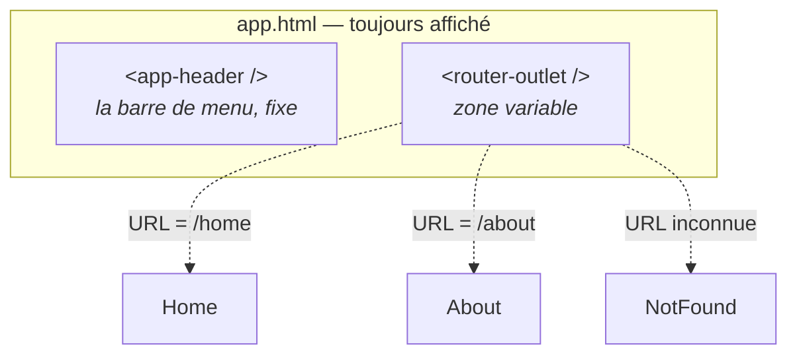

# M2 — Navigation

> 🟢 **Parcours MODERN** — composants autonomes et signaux.
> Chapitre équivalent en LEGACY : [L2](../LEGACY/L2-NAV.md).

**Scénario à réaliser en autonomie.** Vos quatre composants existent mais rien ne les
affiche. Vous allez brancher le **routeur** : associer chaque URL à un composant, puis
construire une barre de menu pour circuler entre les pages. Chapitre **très guidé**.

## ✨ Objectifs

- Comprendre le rôle du routeur et de `<router-outlet />`
- Déclarer des routes, une redirection et une page 404
- Construire une barre de navigation avec Angular Material
- Distinguer un lien Angular (`routerLink`) d'un lien HTML classique (`href`)

## 📁 Point de départ

Le projet du [chapitre 1](M1-SCAFFOLD.md), avec `pages/home`, `pages/about`,
`pages/not-found` et `pages/layout/header`.

---

## 🧭 1 — Comment fonctionne le routeur

Une application Angular est une **application à page unique** (*single page application*) :
le navigateur ne charge qu'un seul document HTML. Quand vous cliquez sur « À propos », la
page n'est pas rechargée — Angular **remplace un morceau** de l'affichage.

Ce morceau est marqué par une balise spéciale :



Le principe tient en une phrase : **le routeur regarde l'URL, trouve la route correspondante,
et affiche le composant associé à l'endroit du `<router-outlet />`.** Tout ce qui est autour
(la barre de menu) reste en place.

---

## 🗺️ 2 — Déclarer les routes

Les routes se déclarent dans `src/app/app.routes.ts`. Ouvrez ce fichier : il contient un
tableau vide.

Une route est un objet qui associe un chemin à un composant :

| Propriété | Rôle |
|---|---|
| `path` | Le chemin de l'URL, **sans barre oblique** au début (`'home'`, pas `'/home'`) |
| `component` | Le composant à afficher pour ce chemin |
| `redirectTo` | Renvoie vers un autre chemin au lieu d'afficher un composant |
| `pathMatch` | Avec `redirectTo` : `'full'` exige que l'URL entière corresponde |

Deux chemins ont une signification particulière :

| Chemin | Signifie |
|---|---|
| `''` | La racine du site (`http://localhost:4200/`) |
| `'**'` | **N'importe quelle** URL non reconnue. À placer **en dernier**. |

🚧 **À compléter** — `src/app/app.routes.ts` :

```ts
import { Routes } from '@angular/router';
import { Home } from './pages/home/home';
import { About } from './pages/about/about';
import { NotFound } from './pages/not-found/not-found';

export const routes: Routes = [
  { path: 'home', component: Home },
  // TODO : une route 'about' qui affiche le composant About

  // TODO : la racine ('') doit rediriger vers 'home'
  //        (pensez à redirectTo et pathMatch: 'full')

  // TODO : toute URL inconnue ('**') doit afficher NotFound
  //        /!\ cette route doit rester la DERNIÈRE du tableau
];
```

> 📖 [Définir des routes](https://angular.dev/guide/routing/define-routes)

> ⚠️ **Piège — l'ordre du tableau compte.**
> - *Symptôme :* toutes les pages affichent « 404 », même `/home`.
> - *Cause :* la route `'**'` a été placée avant les autres. Le routeur lit le tableau **de
>   haut en bas** et s'arrête à la première correspondance ; or `'**'` correspond à tout.
> - *Correctif :* déplacer `{ path: '**', ... }` en dernière position.

### Pourquoi `pathMatch: 'full'` ?

Sans cette précision, Angular considère qu'une route `''` correspond au **début** de
n'importe quelle URL — donc à toutes. `pathMatch: 'full'` impose que l'URL soit *exactement*
vide. C'est obligatoire dès qu'on associe une redirection à `''`.

---

## 🔌 3 — Vérifier que le routeur est branché

Ouvrez `src/app/app.config.ts` :

```ts
export const appConfig: ApplicationConfig = {
  providers: [
    provideBrowserGlobalErrorListeners(),
    provideRouter(routes),          // <- le routeur, avec vos routes
  ],
};
```

`provideRouter(routes)` active le routeur et lui transmet votre tableau. Comme vous avez créé
le projet avec `--routing=true` au chapitre 1, cette ligne est déjà là : rien à modifier.

> ℹ️ Un `provide…()` déclare un service disponible dans toute l'application. Vous en ajouterez
> un autre au chapitre 6 pour les appels HTTP.

Assurez-vous enfin que `src/app/app.html` contient bien la zone variable :

```html
<router-outlet />
```

> 💡 **Tester :** rendez-vous sur <http://localhost:4200>. Vous êtes redirigé vers `/home` et
> voyez « Bienvenue ». Essayez `/about`, puis une URL inventée comme `/nimportequoi` : vous
> devez voir « 404 ».

---

## 🧰 4 — La barre de navigation

Place au menu. Il utilisera quatre composants Material :

| Module Material | Ce qu'il apporte |
|---|---|
| `MatToolbarModule` | La barre `<mat-toolbar>` |
| `MatButtonModule` | Les boutons et liens stylés (`matButton`) |
| `MatIconModule` | Les icônes `<mat-icon>` |
| `MatBadgeModule` | La pastille de comptage (pour le panier, au chapitre 5) |

En MODERN, un composant déclare lui-même ce qu'il utilise. Il faut donc importer ces modules
**dans le composant `Header`**.

🚧 **À compléter** — `src/app/pages/layout/header/header.ts` :

```ts
import { Component } from '@angular/core';
import { RouterLink, RouterLinkActive } from '@angular/router';
import { MatToolbarModule } from '@angular/material/toolbar';
import { MatButtonModule } from '@angular/material/button';

@Component({
  selector: 'app-header',
  // TODO : déclarer ici ce que le gabarit utilise :
  //        RouterLink, RouterLinkActive, MatToolbarModule, MatButtonModule
  imports: [],
  templateUrl: './header.html',
  styleUrl: './header.scss',
})
export class Header {}
```

### Les liens de navigation

Dans le gabarit, **n'utilisez pas `href`**. La différence est fondamentale :

| Écriture | Comportement |
|---|---|
| `<a href="/about">` | Le navigateur **recharge** toute l'application. Lent, et l'état est perdu. |
| `<a routerLink="/about">` | Le routeur Angular change la vue **sans recharger**. |

`routerLinkActive="active"` complète le dispositif : la directive ajoute la classe CSS
`active` au lien correspondant à l'URL courante. Pratique pour signaler où l'on se trouve.

🚧 **À compléter** — `src/app/pages/layout/header/header.html` :

```html
<mat-toolbar color="primary">
  <span>My App</span>

  <a matButton routerLink="/home" routerLinkActive="active">Accueil</a>
  <!-- TODO : un lien vers /about, libellé « À propos », sur le même modèle -->

  <span class="spacer"></span>
  <!-- La zone de droite (panier, connexion) sera ajoutée aux chapitres 5 et 7. -->
</mat-toolbar>
```

**`src/app/pages/layout/header/header.scss`** — l'élément `.spacer` pousse ce qui suit vers
la droite :

```scss
.spacer {
  flex: 1 1 auto;
}

.active {
  font-weight: 700;
}
```

> 📖 [RouterLink](https://angular.dev/api/router/RouterLink) ·
> [Barre d'outils Material](https://material.angular.dev/components/toolbar/overview)

---

## 🧩 5 — Afficher le menu dans l'application

Le composant `Header` existe mais rien ne l'affiche. Comme à la manip du chapitre 1, il faut
l'importer dans `App` et poser sa balise.

🚧 **À compléter** — `src/app/app.ts` :

```ts
import { Component } from '@angular/core';
import { RouterOutlet } from '@angular/router';
// TODO : importer le composant Header

@Component({
  selector: 'app-root',
  // TODO : ajouter Header à côté de RouterOutlet
  imports: [RouterOutlet],
  templateUrl: './app.html',
  styleUrl: './app.scss',
})
export class App {}
```

**`src/app/app.html`** — remplacez tout le contenu par :

```html
<app-header />

<main class="content">
  <router-outlet />
</main>
```

**`src/app/app.scss`** — un peu d'air autour du contenu :

```scss
.content {
  padding: 24px;
}
```

> 💡 **Tester :** la barre de menu apparaît en haut, et reste en place quand vous passez de
> « Accueil » à « À propos ». Seul le contenu sous la barre change — c'est exactement le rôle
> du `<router-outlet />`.

> ⚠️ **Piège — `'app-header' is not a known element`.**
> - *Symptôme :* ce message apparaît dans la console du navigateur, et le menu ne s'affiche pas.
> - *Cause :* la balise est posée dans `app.html`, mais le composant n'a pas été ajouté aux
>   `imports` de `app.ts`. En MODERN, poser la balise ne suffit jamais.
> - *Correctif :* ajouter `Header` au tableau `imports` **et** vérifier la ligne `import`
>   correspondante en haut du fichier.

---

## 🎉 Challenge final

- [ ] `/home` affiche « Bienvenue », `/about` affiche « À propos »
- [ ] La racine `/` redirige automatiquement vers `/home`
- [ ] Une URL inventée affiche la page 404
- [ ] La barre de menu est visible sur toutes les pages
- [ ] Cliquer sur un lien ne recharge pas la page (l'onglet du navigateur ne clignote pas)
- [ ] Le lien de la page courante est en gras (classe `active`)

## ✅ Bonus

- Ajoutez un lien vers une page inexistante (`/contact`) : vous devez atterrir sur le 404.
- Dans `not-found.html`, ajoutez un lien de retour vers l'accueil. Attention : `routerLink`
  est une directive, il faudra donc l'importer dans `NotFound` — même logique qu'au point 5.

## Récap

- Le routeur associe une **URL** à un **composant**, affiché à l'emplacement du
  `<router-outlet />`.
- Les routes se déclarent dans `app.routes.ts` ; l'ordre compte, et `'**'` se place en dernier.
- `routerLink` navigue sans recharger la page, contrairement à `href`.
- En MODERN, tout composant ou directive utilisé dans un gabarit doit figurer dans les
  `imports` du composant.

➡️ **Chapitre suivant : [M3 — Feature Product et chargement à la demande](M3-LAZY.md)**
