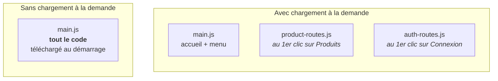
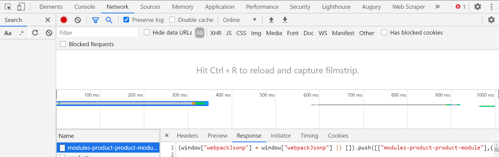

# M3 — Feature Product et chargement à la demande

> 🟢 **Parcours MODERN** — composants autonomes et signaux.
> Chapitre équivalent en LEGACY : [L3](../LEGACY/L3-PRODUCT-MODULE.md).

**Scénario à réaliser en autonomie.** Vous allez regrouper tout ce qui concerne les produits
dans un dossier autonome, lui donner ses propres routes, et faire en sorte que son code ne
soit **téléchargé qu'au moment où l'utilisateur en a besoin**. Chapitre **très guidé**.

## ✨ Objectifs

- Organiser une application par **fonctionnalité** plutôt que par type de fichier
- Déclarer les routes d'une fonctionnalité dans son propre fichier
- Mettre en place le **chargement à la demande** (*lazy loading*)
- Le **constater** dans l'onglet Réseau du navigateur
- Découvrir le préchargement (aperçu)

## 📁 Point de départ

Le projet du [chapitre 2](M2-NAV.md), avec une navigation fonctionnelle. À la fin de ce
chapitre :

```
src/app/
├── modules/
│   └── product/                    <- la fonctionnalité, isolée
│       ├── pages/product-dashboard/
│       ├── models/product.ts
│       ├── services/product.ts
│       └── product.routes.ts       <- ses propres routes
├── pages/                          (inchangé)
└── app.routes.ts                   <- pointera vers product.routes.ts
```

---

## 🧱 1 — Pourquoi regrouper par fonctionnalité

Jusqu'ici, tous les composants sont rangés dans `pages/`. Ça marche pour quatre fichiers.
Sur une vraie application — trente composants, dix services — ce rangement devient
ingérable : les fichiers liés aux produits se retrouvent éparpillés.

On préfère donc regrouper **par domaine métier** :

| Rangement | Structure | Problème / avantage |
|---|---|---|
| Par **type** | `components/`, `services/`, `models/` | Les fichiers d'une même fonctionnalité sont dispersés |
| Par **fonctionnalité** | `product/`, `cart/`, `auth/` | Tout ce qui concerne les produits est au même endroit ✅ |

L'avantage décisif apparaît à la section 4 : une fonctionnalité bien isolée peut être
**chargée séparément**.

---

## 🏗️ 2 — Générer la fonctionnalité Product

Trois commandes. Notez la nouveauté : `ng g i` et `ng g s`.

```bash
npx ng g c modules/product/pages/ProductDashboard --skip-tests
npx ng g i modules/product/models/Product
npx ng g s modules/product/services/Product --skip-tests
```

| Commande | Génère | Rôle |
|---|---|---|
| `ng g c` | un **composant** | Affiche quelque chose |
| `ng g i` | une **interface** | Décrit la *forme* d'une donnée (pas de code exécuté) |
| `ng g s` | un **service** | Détient une donnée ou un savoir-faire partagé |

> ⚠️ **Renommez la classe du service tout de suite.** Le générateur crée
> `services/product.ts` contenant `export class Product` — un nom qui **entre en collision**
> avec l'interface `Product` du modèle. Ouvrez le fichier et renommez la classe en
> **`ProductService`** (gardez le nom de fichier `product.ts`). Vous obtiendrez :
>
> ```ts
> import { Service } from '@angular/core';
>
> @Service()
> export class ProductService {}
> ```
>
> *(`@Service()` est un raccourci d'Angular 22 pour `@Injectable({ providedIn: 'root' })`.)*

### Le modèle de données

Une interface TypeScript décrit la forme d'un objet. Elle disparaît à la compilation : son
seul rôle est de permettre à l'éditeur et au compilateur de vous prévenir en cas d'erreur.

🚧 **À compléter** — `src/app/modules/product/models/product.ts` :

```ts
export interface Product {
  id?: number;        // le ? signifie « facultatif » : absent tant que le serveur ne l'a pas attribué
  // TODO : un champ name, de type string
  // TODO : un champ price, de type number
}
```

> 💡 **Tester :** dans `product-dashboard.ts`, tapez temporairement
> `const p: Product = { name: 'x' };`. L'éditeur doit souligner l'erreur : `price` manque.
> Supprimez la ligne ensuite.

---

## 🗺️ 3 — Les routes de la fonctionnalité

La fonctionnalité déclare ses propres routes, dans son propre fichier. Créez-le à la main :

**`src/app/modules/product/product.routes.ts`**

```ts
import { Routes } from '@angular/router';
import { ProductDashboard } from './pages/product-dashboard/product-dashboard';

/**
 * Routes internes de la fonctionnalité Product.
 * Elles seront préfixées par le chemin déclaré dans app.routes.ts.
 */
export const PRODUCT_ROUTES: Routes = [
  { path: 'dashboard', component: ProductDashboard },
  { path: '', redirectTo: 'dashboard', pathMatch: 'full' },
];
```

Point important : ces chemins sont **relatifs**. En les branchant sous `/products` à l'étape
suivante, on obtiendra :

| Route déclarée ici | URL finale |
|---|---|
| `'dashboard'` | `/products/dashboard` |
| `''` (redirection) | `/products` => redirigé vers `/products/dashboard` |

---

## ⚡ 4 — Le chargement à la demande

Voici le cœur du chapitre.

**Le problème.** Par défaut, tout le code de l'application est empaqueté dans un seul gros
fichier JavaScript, téléchargé au premier affichage. Un visiteur qui ne consulte que la page
d'accueil télécharge quand même le code des produits, du panier, de l'administration…

**La solution.** Demander à Angular de mettre le code d'une fonctionnalité dans un fichier
**séparé**, téléchargé seulement quand l'utilisateur visite l'URL correspondante.



Cela se joue sur **une seule propriété** : au lieu de `component`, on écrit `loadChildren`.

| Propriété | Comportement |
|---|---|
| `component: X` | Le composant `X` est inclus dans le fichier principal |
| `loadChildren: () => import(…)` | Le code est mis à part et téléchargé **au premier accès** |

La valeur de `loadChildren` est une **fonction** — c'est ce détail qui fait tout. Angular ne
l'appelle qu'au moment voulu ; tant qu'on ne l'appelle pas, le `import()` n'est pas déclenché
et le fichier n'est pas téléchargé.

🚧 **À compléter** — `src/app/app.routes.ts` :

```ts
import { Routes } from '@angular/router';
import { Home } from './pages/home/home';
import { About } from './pages/about/about';
import { NotFound } from './pages/not-found/not-found';

export const routes: Routes = [
  { path: 'home', component: Home },
  { path: 'about', component: About },

  // TODO : la route 'products' doit charger PRODUCT_ROUTES à la demande.
  //        Modèle à compléter :
  // {
  //   path: 'products',
  //   loadChildren: () => import('./modules/product/product.routes')
  //                         .then((m) => m.PRODUCT_ROUTES),
  // },

  { path: '', redirectTo: 'home', pathMatch: 'full' },
  { path: '**', component: NotFound },
];
```

Ajoutez enfin un lien dans le menu — `src/app/pages/layout/header/header.html`, après le lien
« Accueil » :

```html
<a matButton routerLink="/products" routerLinkActive="active">Produits</a>
```

> 📖 [Chargement à la demande](https://angular.dev/guide/routing/define-routes#lazily-loaded-routes)

> ⚠️ **Piège — ne pas importer le composant dans `app.routes.ts`.**
> - *Symptôme :* le chargement à la demande « ne marche pas » : aucun fichier séparé n'apparaît.
> - *Cause :* un `import { ProductDashboard } from '...'` a été laissé en haut de
>   `app.routes.ts`. Cet import **statique** force l'inclusion du composant dans le fichier
>   principal, ce qui annule tout le bénéfice.
> - *Correctif :* `app.routes.ts` ne doit contenir **aucun** import des composants chargés à la
>   demande. Seule la fonction `() => import(...)` y fait référence.

---

## 🔬 5 — Constater le chargement à la demande

Une affirmation ne vaut rien sans vérification. Deux façons de l'observer.

### a. Dans les journaux du build

Arrêtez le serveur et relancez-le (`npm start`), puis lisez la sortie :

```
Initial chunk files | Names          |  Raw size
main-UKBX6KWN.js    | main           | 379.36 kB

Lazy chunk files    | Names          |  Raw size
chunk-ifO-MLb7.js   | product-routes |  11.96 kB
```

La section **`Lazy chunk files`** est la preuve : `product-routes` est dans un fichier à part.

### b. Dans le navigateur

> **🧪 Manip — voir le fichier arriver**
>
> 1. Ouvrez <http://localhost:4200/home>
> 2. Ouvrez les outils de développement (`F12`), onglet **Réseau** (*Network*)
> 3. Cochez **Conserver le journal** (*Preserve log*) et filtrez sur **JS**
> 4. Rechargez la page, puis **cliquez sur « Produits »** dans le menu
>
> *Observé : au clic, une nouvelle ligne apparaît dans la liste — le fichier
> `chunk-….js` correspondant à `product-routes`. Il n'avait pas été téléchargé au
> démarrage.*



Recliquez sur « Accueil » puis « Produits » : aucun nouveau téléchargement. Le fichier est en
cache, le coût n'est payé **qu'une fois**.

---

## 🌉 Ouverture — le préchargement

Le chargement à la demande a une contrepartie : au **premier** clic sur « Produits »,
l'utilisateur attend le téléchargement. Sur une connexion lente, cela se voit.

D'où une stratégie intermédiaire, le **préchargement** : Angular affiche d'abord la page
d'accueil, puis, une fois l'application au repos, télécharge **en arrière-plan** les
fonctionnalités non encore visitées. Le clic devient instantané, sans alourdir le démarrage.

Une ligne suffit — dans `src/app/app.config.ts` :

```ts
import { provideRouter, withPreloading, PreloadAllModules } from '@angular/router';

providers: [
  provideRouter(routes, withPreloading(PreloadAllModules)),
]
```

Refaites la manip : le fichier de la fonctionnalité apparaît désormais **quelques instants
après le chargement de l'accueil**, sans que vous ayez cliqué.

On peut aussi écrire une stratégie sur mesure (ne précharger que certaines routes, ou
seulement en connexion rapide). C'est un sujet avancé — retenez pour l'instant que les trois
comportements existent :

| Stratégie | Quand le code est téléchargé |
|---|---|
| Aucune (défaut) | Au premier accès à la route |
| `PreloadAllModules` | En arrière-plan, dès que l'application est au repos |
| Sur mesure | Selon vos propres critères |

> 📖 [Stratégies de chargement](https://angular.dev/guide/routing/loading-strategies)
>
> ℹ️ Cet encart est un **aperçu** : libre à vous de laisser le préchargement activé ou non
> pour la suite du lab.

---

## 🎉 Challenge final

- [ ] Le dossier `modules/product/` contient les pages, le modèle et le service
- [ ] L'interface `Product` déclare `name` et `price`
- [ ] `/products` redirige vers `/products/dashboard` et affiche le composant
- [ ] Le menu contient un lien « Produits »
- [ ] Les journaux du build montrent `product-routes` dans **`Lazy chunk files`**
- [ ] L'onglet Réseau montre le fichier arrivant **au clic**, pas au démarrage

## ✅ Bonus

- Créez une deuxième fonctionnalité `modules/cart/` sur le même modèle (un composant, un
  fichier de routes), chargée à la demande sous `/cart`. Vérifiez qu'un **deuxième** fichier
  apparaît dans `Lazy chunk files`. C'est exactement ce que vous ferez au chapitre 7 pour
  l'authentification.

## Récap

- On range par **fonctionnalité** (`modules/product/`), pas par type de fichier.
- Une fonctionnalité déclare ses routes dans son propre fichier ; ces chemins sont
  **relatifs** au chemin parent.
- `loadChildren: () => import(...)` met le code à part et ne le télécharge qu'au premier accès.
- Un import statique du composant dans `app.routes.ts` **annule** le bénéfice.
- Le **préchargement** offre un compromis : démarrage léger, clic instantané.

---

## 🛑 Debrief 1

Point d'arrêt collectif. Les questions à savoir répondre :

1. Où le composant associé à une route est-il affiché ?
2. Quelle différence entre `component:` et `loadChildren:` dans une route ?
3. Pourquoi `loadChildren` reçoit-il une **fonction** plutôt qu'un import direct ?
4. Comment prouver, sans faire confiance à personne, que le chargement à la demande
   fonctionne ?

➡️ **Chapitre suivant : [M4 — Interface graphique](M4-UI.md)**
