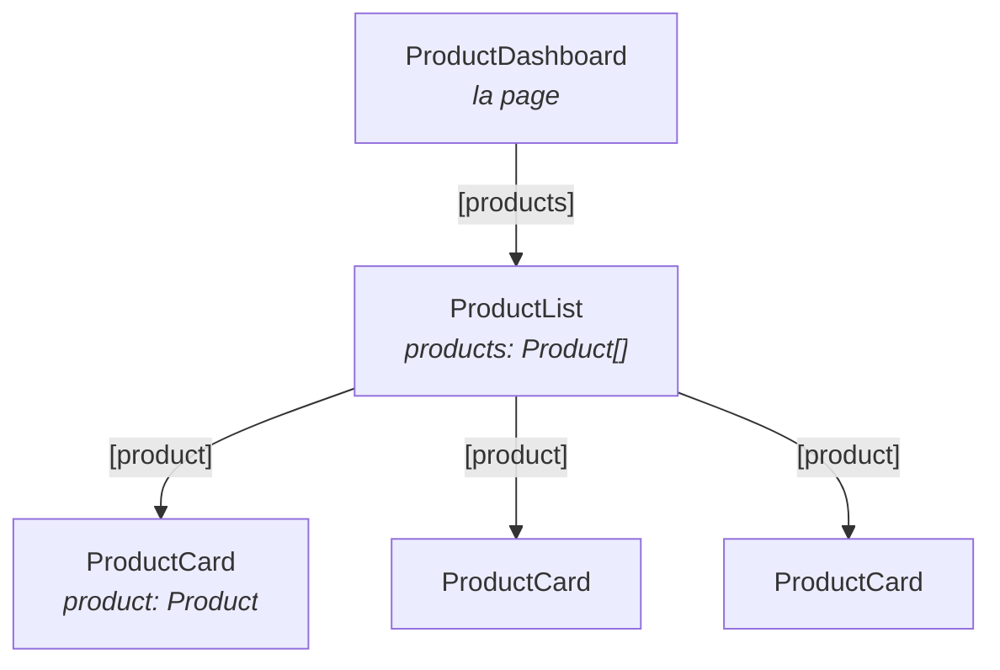

# M4 — Interface graphique

> 🟢 **Parcours MODERN** — composants autonomes et signaux.
> Chapitre équivalent en LEGACY : [L4](../LEGACY/L4-UI.md).

**Scénario à réaliser en autonomie.** Vous allez découper la page produits en trois
composants et faire descendre une donnée du parent vers l'enfant. Le guidage s'allège :
à partir d'ici, vous complétez des `TODO` en vous appuyant sur les tableaux et les liens
de documentation.

## ✨ Objectifs

- Découper une page en composants réutilisables
- Faire passer une donnée d'un composant parent vers son enfant avec `input()`
- Afficher une liste avec `@for`
- Découvrir les **signaux** et comprendre ce qu'ils changent

## 📁 Point de départ

Le projet du [chapitre 3](M3-LAZY.md). À la fin de ce chapitre, la page `/products`
affichera une liste de cartes produits.

---

## 🧩 1 — Le découpage

Une règle simple, valable bien au-delà d'Angular : **un composant, une responsabilité.**

| Composant | Responsabilité | Ce qu'il ignore |
|---|---|---|
| `ProductDashboard` | La **page** : assemble les morceaux | Comment une carte est dessinée |
| `ProductList` | Afficher **N** produits | D'où vient la liste |
| `ProductCard` | Afficher **1** produit | Qu'il existe une liste |

Chaque composant ignore le contexte de celui qui l'utilise. C'est ce qui les rend
réutilisables : `ProductCard` fonctionnera aussi bien dans une liste de résultats de
recherche ou une page de favoris.



Générez les deux composants manquants :

```bash
npx ng g c modules/product/components/ProductCard --skip-tests
npx ng g c modules/product/components/ProductList --skip-tests
```

---

## 📥 2 — Faire descendre une donnée : `input()`

Pour qu'un parent transmette une valeur à son enfant, l'enfant déclare une **entrée**.

```ts
readonly product = input.required<Product>();
```

| Écriture | Signification |
|---|---|
| `input<T>()` | Entrée **facultative**, `undefined` si le parent ne fournit rien |
| `input<T>(valeur)` | Entrée facultative avec une valeur par défaut |
| `input.required<T>()` | Entrée **obligatoire** : le compilateur refuse si le parent l'oublie |

Le parent transmet la valeur par une **liaison de propriété**, entre crochets :

```html
<app-product-card [product]="unProduit" />
```

> ⚠️ **Les crochets ne sont pas décoratifs.**
>
> | Écriture | Ce qui est transmis |
> |---|---|
> | `[product]="unProduit"` | La **valeur** de la variable `unProduit` |
> | `product="unProduit"` | La **chaîne de caractères** `"unProduit"` 😱 |
>
> Sans crochets, Angular transmet le texte littéral. Erreur classique, et le message d'erreur
> n'est pas toujours parlant.

### Un point essentiel : `input()` crée un signal

C'est la nouveauté du parcours MODERN. `input()` ne retourne pas directement la valeur, mais
un **signal** : une valeur qu'on lit **en appelant une fonction**.

```ts
product          // le signal lui-même
product()        // la VALEUR contenue dans le signal
```

Pourquoi ce détour ? Parce qu'en le lisant ainsi, Angular sait **exactement** quels affichages
dépendent de cette valeur, et ne redessine qu'eux quand elle change. C'est ce mécanisme qui
permet le mode `--zoneless` choisi au chapitre 1.

**Conséquence pratique, à ne pas oublier :** dans le gabarit, on écrit `product().name` — avec
les parenthèses.

> 📖 [Entrées d'un composant](https://angular.dev/guide/components/inputs) ·
> [Les signaux](https://angular.dev/guide/signals)

---

## 🃏 3 — Le composant `ProductCard`

La carte affiche un produit avec le composant
[Card de Material](https://material.angular.dev/components/card/overview).

🚧 **À compléter** — `src/app/modules/product/components/product-card/product-card.ts` :

```ts
import { Component, input } from '@angular/core';
import { MatCardModule } from '@angular/material/card';
import { MatButtonModule } from '@angular/material/button';
import { Product } from '../../models/product';

@Component({
  selector: 'app-product-card',
  // TODO : déclarer les modules Material utilisés par le gabarit
  imports: [],
  templateUrl: './product-card.html',
  styleUrl: './product-card.scss',
})
export class ProductCard {
  // TODO : déclarer une entrée OBLIGATOIRE nommée product, de type Product
}
```

🚧 **À compléter** — `product-card.html` :

```html
<mat-card class="product-card">
  <mat-card-header>
    <mat-card-title>{{ product().name }}</mat-card-title>
    <!-- TODO : afficher le prix dans un <mat-card-subtitle>, suivi de « € » -->
  </mat-card-header>
  <mat-card-actions>
    <button matButton>BUY</button>
  </mat-card-actions>
</mat-card>
```

**`product-card.scss`** :

```scss
.product-card {
  width: 220px;
}
```

> ℹ️ `{{ ... }}` est l'**interpolation** : Angular évalue l'expression et insère le résultat
> comme texte. Elle n'accepte que des expressions simples — pas d'instruction `if`, pas
> d'affectation.

---

## 📋 4 — Le composant `ProductList` et la boucle `@for`

Pour répéter un élément, Angular fournit `@for` :

```html
@for (product of products(); track product.name) {
  <app-product-card [product]="product" />
}
```

| Élément | Rôle |
|---|---|
| `product of products()` | Parcourt la liste ; `product` est la variable de boucle |
| `track product.name` | **Obligatoire.** Identifie chaque élément de façon unique |
| `@empty { … }` | Bloc affiché si la liste est vide (facultatif mais recommandé) |

### Pourquoi `track` est obligatoire

Quand la liste change, Angular doit savoir quels éléments sont *les mêmes* qu'avant, pour ne
redessiner que ce qui bouge. `track` lui donne cette identité. Sans elle, il détruirait et
recréerait tout à chaque modification — au mieux lent, au pire vous perdez le focus d'un champ
en cours de saisie.

En pratique, on utilise un identifiant unique (`track product.id`). Nos produits n'ont pas
encore d'identifiant fiable — il arrivera du serveur au chapitre 6 — donc `track product.name`
fera l'affaire ici.

🚧 **À compléter** — `product-list.ts` :

```ts
import { Component, input } from '@angular/core';
import { Product } from '../../models/product';
import { ProductCard } from '../product-card/product-card';

@Component({
  selector: 'app-product-list',
  // TODO : ProductList affiche des ProductCard. Que faut-il déclarer ici ?
  imports: [],
  templateUrl: './product-list.html',
  styleUrl: './product-list.scss',
})
export class ProductList {
  // TODO : une entrée products, de type Product[], avec [] pour valeur par défaut
}
```

🚧 **À compléter** — `product-list.html` :

```html
<div class="product-list">
  <!-- TODO : une boucle @for sur products(), qui affiche un <app-product-card>
       par produit, en lui passant le produit via [product]
       Ajoutez un bloc @empty affichant « Aucun produit pour l'instant. » -->
</div>
```

**`product-list.scss`** :

```scss
.product-list {
  display: flex;
  flex-wrap: wrap;
  gap: 16px;
}
```

> 📖 [La boucle @for](https://angular.dev/guide/templates/control-flow#repeat-content-with-the-for-block)
>
> ℹ️ **Dans un projet plus ancien**, vous verrez `*ngFor="let p of products"`. Même rôle ; la
> syntaxe `@for` l'a remplacée depuis Angular 17 et ne nécessite aucun import.

---

## 🖼️ 5 — Assembler dans la page

Le tableau de bord assemble le tout. Pour l'instant, la liste est écrite en dur dans le
composant — elle viendra du serveur au chapitre 6.

🚧 **À compléter** — `product-dashboard.ts` :

```ts
import { Component, signal } from '@angular/core';
import { Product } from '../../models/product';
import { ProductList } from '../../components/product-list/product-list';

@Component({
  selector: 'app-product-dashboard',
  // TODO : déclarer ProductList
  imports: [],
  templateUrl: './product-dashboard.html',
  styleUrl: './product-dashboard.scss',
})
export class ProductDashboard {
  // Un signal qui contient la liste. On le lira avec products() dans le gabarit.
  readonly products = signal<Product[]>([
    { name: 'Clavier mécanique', price: 89 },
    { name: 'Souris ergonomique', price: 45 },
    // TODO : ajoutez un troisième produit
  ]);
}
```

🚧 **À compléter** — `product-dashboard.html` :

```html
<h1>Nos produits</h1>

<!-- TODO : afficher <app-product-list>, en lui passant la liste via [products] -->
```

> 💡 **Tester :** rendez-vous sur <http://localhost:4200/products>. Trois cartes s'affichent
> côte à côte, avec nom et prix. Un bouton BUY figure sur chacune — il ne fait rien encore,
> c'est l'objet du chapitre 5.

> ⚠️ **Piège — `products` vs `products()`.**
> - *Symptôme :* la liste ne s'affiche pas, ou l'éditeur signale un type incompatible.
> - *Cause :* `products` est le signal, pas son contenu. Dans `@for`, il faut **appeler** le
>   signal : `products()`.
> - *Correctif :* ajoutez les parenthèses. Règle générale en MODERN : un signal se lit
>   toujours avec `()`.

---

## 🧪 Manip — pourquoi un signal ?

Vous vous demandez peut-être pourquoi passer par `signal([...])` plutôt qu'un simple tableau.
Faisons l'expérience.

1. Dans `product-dashboard.ts`, remplacez temporairement le signal par un tableau ordinaire :

   ```ts
   products: Product[] = [{ name: 'Clavier mécanique', price: 89 }];
   ```

   Adaptez le gabarit (`[products]="products"`, sans parenthèses).

2. Ajoutez un bouton de test dans `product-dashboard.html` :

   ```html
   <button (click)="products.push({ name: 'Ajouté', price: 1 })">Test</button>
   ```

3. Cliquez.

*Observé : rien ne se passe. Le tableau contient pourtant bien le nouveau produit — mais
l'affichage n'est pas mis à jour.*

<details>
<summary>Explication</summary>

Nous avons créé le projet en mode **zoneless** (chapitre 1) : Angular ne surveille plus
l'application en permanence. Il ne peut donc pas deviner qu'un `push()` a modifié le tableau.

Un **signal**, lui, prévient Angular dès qu'il change. D'où la règle : en zoneless, tout état
affiché doit vivre dans un signal, et on le modifie avec ses méthodes :

| Méthode | Usage |
|---|---|
| `products()` | Lire la valeur |
| `products.set([...])` | Remplacer la valeur |
| `products.update(l => [...l, nouveau])` | Calculer la nouvelle valeur à partir de l'ancienne |

Notez qu'on ne modifie jamais le tableau en place : on en crée un nouveau. C'est ainsi que le
signal détecte le changement.

</details>

**Annulez entièrement la manip** avant de poursuivre :

1. rétablissez le `signal<Product[]>([...])` dans `product-dashboard.ts` ;
2. remettez les parenthèses dans le gabarit : `[products]="products()"` ;
3. **supprimez le bouton `Test`** ajouté à l'étape 2.

---

## 🎉 Challenge final

- [ ] `/products` affiche trois cartes Material, côte à côte
- [ ] Chaque carte montre le nom et le prix de son produit
- [ ] `ProductCard` ne connaît **qu'un** produit, et ignore l'existence de la liste
- [ ] Vider la liste dans le dashboard fait apparaître le message du bloc `@empty`
- [ ] Vous savez expliquer pourquoi on écrit `products()` et non `products`

## ✅ Bonus

- Ajoutez au `ProductCard` une entrée facultative `currency` valant `'€'` par défaut, et
  utilisez-la dans le gabarit. Vérifiez qu'une carte sans cet attribut affiche toujours `€`.
- Affichez le prix avec le *pipe* `currency` :
  `{{ product().price | currency:'EUR' }}`. Il faudra importer `CurrencyPipe`.
  ([doc](https://angular.dev/api/common/CurrencyPipe))

## Récap

- Un composant, une responsabilité : la page assemble, la liste répète, la carte affiche.
- `input()` déclare une entrée ; `input.required()` la rend obligatoire.
- Le parent transmet avec **`[propriete]="valeur"`** — les crochets sont indispensables.
- En MODERN, une entrée est un **signal** : on la lit avec `()`.
- `@for` répète un bloc et exige `track` pour identifier chaque élément.

---

## 🛑 Debrief 2

1. Pourquoi découper en trois composants plutôt qu'écrire toute la page d'un bloc ?
2. Quelle différence entre `[product]="p"` et `product="p"` ?
3. Pourquoi `track` est-il obligatoire dans `@for` ?
4. Pourquoi lit-on un signal avec des parenthèses ?

---

➡️ **Chapitre suivant : [M5 — Formulaires et interactions](M5-FORMS-INTERACTIONS.md)**
