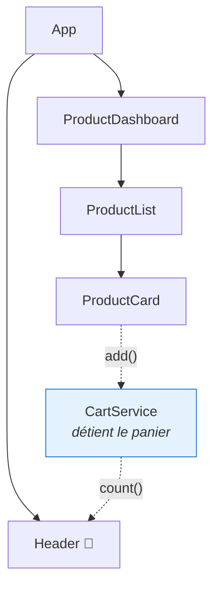

# M5 — Formulaires et interactions

> 🟢 **Parcours MODERN** — composants autonomes et signaux.
> Chapitre équivalent en LEGACY : [L5](../LEGACY/L5-FORMS-INTERACTIONS.md).

**Scénario à réaliser en autonomie.** Vous allez saisir un produit dans un formulaire, le
faire remonter jusqu'à la page, puis le mettre au panier — et voir le compteur du menu
s'incrémenter. Guidage en **codes à trou**.

## ✨ Objectifs

- Connaître les trois façons de faire un formulaire, et savoir laquelle choisir
- Faire remonter une donnée de l'enfant vers le parent avec `output()`
- Partager un état entre deux composants éloignés grâce à un **service**
- Comprendre `computed()` : une valeur dérivée, toujours à jour

## 📁 Point de départ

Le projet du [chapitre 4](M4-UI.md), avec la liste de cartes affichée.

---

## 📝 1 — Trois façons de faire un formulaire

Angular en propose trois. Les voir dans l'ordre permet de comprendre *pourquoi* la suivante
existe.

### Niveau 1 — Le formulaire par gabarit (*template-driven*)

Tout se passe dans le HTML, avec `[(ngModel)]` :

```html
<input [(ngModel)]="name" name="name" />
```

Cette syntaxe `[( )]`, surnommée *banana in a box*, combine les deux liaisons vues au
chapitre 4 : `[ ]` fait descendre la valeur, `( )` fait remonter la modification. Simple et
direct.

**Sa limite :** la validation devient vite illisible dès que les règles se croisent, et le
code TypeScript n'a pas de vision d'ensemble du formulaire. Passé deux ou trois champs, on
sature.

### Niveau 2 — Le formulaire réactif typé (*reactive forms*)

Le formulaire est décrit **en TypeScript** :

```ts
readonly form = new FormGroup({
  name: new FormControl('', { nonNullable: true, validators: [Validators.required] }),
});
```

L'objet `form` devient la source de vérité : on peut l'interroger, le valider, l'observer.
Et parce qu'il est **typé**, l'éditeur connaît le type de chaque champ.

**C'est le choix de ce lab**, et de l'immense majorité des projets aujourd'hui.

### Niveau 3 — Les formulaires à signaux (*signal forms*)

Introduits récemment, ils rapprochent les formulaires du modèle des signaux :

```ts
import { form, required } from '@angular/forms/signals';

readonly model = signal({ name: '', price: 0 });
readonly f = form(this.model, (path) => {
  required(path.name);
});
```

**Quand les utiliser ?** Sur un projet neuf, entièrement bâti sur les signaux. L'API est
stable depuis Angular 22, mais la documentation et les exemples en ligne restent rares —
raison pour laquelle ce lab s'en tient au niveau 2.

### En résumé

| | Niveau 1 — gabarit | Niveau 2 — réactif typé | Niveau 3 — signaux |
|---|---|---|---|
| Où est décrit le formulaire | Dans le HTML | En TypeScript | En TypeScript |
| Typage | Faible | **Fort** | Fort |
| Validation complexe | Pénible | Confortable | Confortable |
| Maturité de l'écosystème | Ancienne, très répandue | **Standard actuel** | Récente |
| À choisir pour | Un formulaire de 1-2 champs | **La plupart des cas** | Un projet neuf tout-signaux |

> 📖 [Formulaires réactifs](https://angular.dev/guide/forms/reactive-forms) ·
> [Formulaires par gabarit](https://angular.dev/guide/forms/template-driven-forms) ·
> [Formulaires à signaux](https://angular.dev/guide/forms/signals)

---

## 📤 2 — Faire remonter une donnée : `output()`

Au chapitre 4, `input()` faisait **descendre** une donnée. Pour la faire **remonter**, on
utilise `output()`.

```ts
readonly add = output<Product>();   // déclaration dans l'enfant
this.add.emit(unProduit);           // émission
```

Le parent écoute avec des parenthèses — exactement comme un `(click)` :

```html
<app-product-form (add)="onAdd($event)" />
```

`$event` est une variable fournie par Angular : elle contient la valeur émise.

| Sens | Écriture | Mot-clé |
|---|---|---|
| Parent ➡ enfant | `[product]="p"` | `input()` |
| Enfant ➡ parent | `(add)="onAdd($event)"` | `output()` |

> 📖 [Sorties d'un composant](https://angular.dev/guide/components/outputs)

---

## ✍️ 3 — Le formulaire produit

Générez le composant :

```bash
npx ng g c modules/product/components/ProductForm --skip-tests
```

Les classes à connaître :

| Classe | Rôle |
|---|---|
| `FormGroup` | Un groupe de champs — le formulaire entier |
| `FormControl` | Un champ individuel |
| `Validators` | Les règles de validation (`required`, `min`, `email`…) |
| `nonNullable: true` | Le champ ne peut pas valoir `null` ; le typage est plus strict |

🚧 **À compléter** — `product-form.ts` :

```ts
import { Component, output } from '@angular/core';
import { FormControl, FormGroup, ReactiveFormsModule, Validators } from '@angular/forms';
import { MatFormFieldModule } from '@angular/material/form-field';
import { MatInputModule } from '@angular/material/input';
import { MatButtonModule } from '@angular/material/button';
import { Product } from '../../models/product';

@Component({
  selector: 'app-product-form',
  // TODO : ReactiveFormsModule + les 3 modules Material
  imports: [],
  templateUrl: './product-form.html',
  styleUrl: './product-form.scss',
})
export class ProductForm {
  // TODO : déclarer une sortie nommée add, qui émettra un Product

  readonly form = new FormGroup({
    name: new FormControl('', { nonNullable: true, validators: [Validators.required] }),
    // TODO : un champ price, initialisé à 0, avec le validateur Validators.min(0)
  });

  onSubmit(): void {
    if (this.form.invalid) {
      return;                      // on n'émet rien si la saisie est invalide
    }
    // TODO : émettre la valeur du formulaire via la sortie add
    //        (utilisez this.form.getRawValue())
    this.form.reset();
  }
}
```

🚧 **À compléter** — `product-form.html` :

```html
<form class="product-form" [formGroup]="form" (ngSubmit)="onSubmit()">
  <mat-form-field>
    <mat-label>Nom</mat-label>
    <input matInput formControlName="name" />
  </mat-form-field>

  <!-- TODO : le même bloc pour le prix, avec type="number" et formControlName="price" -->

  <button matButton="filled" type="submit" [disabled]="form.invalid">Ajouter</button>
</form>
```

**`product-form.scss`** :

```scss
.product-form {
  display: flex;
  align-items: center;
  gap: 16px;
}
```

Trois attributs font le lien entre le HTML et le TypeScript :

| Attribut | Rôle |
|---|---|
| `[formGroup]="form"` | Relie le `<form>` à votre objet `form` |
| `formControlName="name"` | Relie ce champ à la clé `name` du `FormGroup` |
| `(ngSubmit)` | Se déclenche à la soumission — au clic **et** à la touche Entrée |

> ⚠️ **Piège — `formControlName` sans `ReactiveFormsModule`.**
> - *Symptôme :* `Can't bind to 'formGroup' since it isn't a known property of 'form'`.
> - *Cause :* `ReactiveFormsModule` manque dans les `imports` du composant.
> - *Correctif :* l'ajouter. En MODERN, tout ce qu'utilise le gabarit doit y être déclaré.

---

## 🔗 4 — Brancher le formulaire sur la page

Le formulaire émet, la page écoute et ajoute à la liste.

🚧 **À compléter** — `product-dashboard.ts` :

```ts
export class ProductDashboard {
  readonly products = signal<Product[]>([
    { name: 'Clavier mécanique', price: 89 },
    { name: 'Souris ergonomique', price: 45 },
    { name: 'Écran 27 pouces', price: 249 },
  ]);

  onAdd(product: Product): void {
    // TODO : ajouter le produit à la liste.
    //        Utilisez products.update() et créez un NOUVEAU tableau :
    //        this.products.update((list) => [...list, product]);
  }
}
```

🚧 **À compléter** — `product-dashboard.html` :

```html
<h1>Nos produits</h1>

<!-- TODO : afficher <app-product-form> et écouter sa sortie (add) -->

<app-product-list [products]="products()" />
```

*(Pensez à ajouter `ProductForm` aux `imports` du dashboard.)*

> 💡 **Tester :** saisissez « Souris sans fil » / `25`, cliquez sur **Ajouter**. Une quatrième
> carte apparaît, et le formulaire se vide.

> ⚠️ **Piège — `push()` ne met rien à jour.**
> - *Symptôme :* le produit n'apparaît pas, alors que le code semble juste.
> - *Cause :* `this.products().push(p)` modifie le tableau **en place**. Le signal contient
>   toujours la même référence : il ne détecte aucun changement (voir la manip du chapitre 4).
> - *Correctif :* créer un nouveau tableau —
>   `this.products.update((list) => [...list, product])`.

---

## 🛒 5 — Le panier : partager un état entre composants éloignés

Nouveau besoin : cliquer sur **BUY** doit incrémenter un compteur **dans le menu**.

Le problème est structurel. `ProductCard` et `Header` ne sont ni parents ni enfants l'un de
l'autre — ils vivent dans des branches séparées de l'application. Aucune combinaison
d'`input()` et d'`output()` ne peut les relier raisonnablement.



**La solution : un service.** Une classe qui détient l'état, injectable partout. C'est
l'application directe de la règle du README : *un composant affiche, un service sait*.

```bash
npx ng g s modules/cart/services/Cart --skip-tests
```
> ⚠️ **Comme au chapitre 3, renommez la classe générée.** `ng g s` crée `services/cart.ts`
> contenant `export class Cart` : renommez cette classe en **`CartService`** (le nom de
> fichier `cart.ts` reste inchangé).

### `computed()` : une valeur dérivée

Le service expose le nombre d'articles. Plutôt que de maintenir un compteur à la main — qu'on
oubliera forcément de décrémenter un jour —, on le **dérive** de la liste :

```ts
readonly count = computed(() => this.items().length);
```

`computed()` crée un signal calculé à partir d'autres signaux. Il se recalcule tout seul quand
`items` change, et jamais autrement. Impossible de le désynchroniser.

🚧 **À compléter** — `src/app/modules/cart/services/cart.ts` :

```ts
import { Injectable, computed, signal } from '@angular/core';
import { Product } from '../../product/models/product';

@Injectable({ providedIn: 'root' })
export class CartService {
  /** Source de vérité : les produits ajoutés au panier. */
  private readonly items = signal<Product[]>([]);

  // TODO : un signal calculé `count`, qui vaut le nombre d'articles

  add(product: Product): void {
    // TODO : ajouter le produit (rappel : on crée un NOUVEAU tableau)
  }
}
```

| Élément | Rôle |
|---|---|
| `@Injectable({ providedIn: 'root' })` | Rend le service disponible partout, en **un seul exemplaire** |
| `private readonly items` | L'état interne : personne ne le modifie de l'extérieur |
| `computed(...)` | Une valeur dérivée, recalculée automatiquement |

> ℹ️ **Un seul exemplaire, c'est essentiel.** Avec `providedIn: 'root'`, tous les composants
> qui demandent `CartService` reçoivent **la même instance**. Sans cela, la carte
> remplirait un panier et le menu en lirait un autre.

---

## 🔌 6 — Brancher le panier

Trois maillons à connecter : la carte émet, la page appelle le service, le menu lit.

**a. `ProductCard`** — ajoutez une sortie `buy` et émettez au clic :

```ts
readonly buy = output<Product>();
```
```html
<button matButton (click)="buy.emit(product())">BUY</button>
```

**b. `ProductList`** — la liste ne fait que **relayer** l'événement vers le haut :

```ts
readonly buy = output<Product>();
```
```html
<app-product-card [product]="product" (buy)="buy.emit($event)" />
```

**c. `ProductDashboard`** — écoutez et transmettez au service :

🚧 **À compléter** :

```ts
import { inject } from '@angular/core';
import { CartService } from '../../../cart/services/cart';

export class ProductDashboard {
  private cartService = inject(CartService);

  onBuy(product: Product): void {
    // TODO : appeler la méthode add du service
  }
}
```
```html
<app-product-list [products]="products()" (buy)="onBuy($event)" />
```

> ℹ️ **`inject()`** est la façon moderne de récupérer un service. On déclare le besoin, Angular
> fournit l'instance. (En LEGACY, on passe par le constructeur — même mécanisme.)

**d. `Header`** — affichez le compteur.

🚧 **À compléter** — `header.ts` :

```ts
import { Component, inject } from '@angular/core';
import { MatIconModule } from '@angular/material/icon';
import { MatBadgeModule } from '@angular/material/badge';
import { CartService } from '../../../modules/cart/services/cart';

export class Header {
  private cart = inject(CartService);

  // TODO : exposer le signal count du service, pour le lire dans le gabarit
  //        readonly count = ... ;
}
```

`header.html` — après le `.spacer` :

```html
<button matIconButton aria-label="Panier">
  <mat-icon [matBadge]="count()" matBadgeColor="warn">shopping_cart</mat-icon>
</button>
```

*(Ajoutez `MatIconModule` et `MatBadgeModule` aux `imports` du `Header`.)*

> 💡 **Tester :** cliquez sur BUY. La pastille passe de 0 à 1, puis 2, 3… Le compteur est
> dans le menu, le clic dans une carte : ils ne se connaissent pas, le service les relie.


---

## 🎉 Challenge final

- [ ] Le formulaire ajoute un produit à la liste, puis se vide
- [ ] Le bouton **Ajouter** est désactivé tant que le nom est vide
- [ ] Cliquer sur BUY incrémente la pastille du menu
- [ ] `ProductCard` ne connaît **ni** la liste **ni** le panier : il se contente d'émettre
- [ ] Vous savez dire pourquoi un service était nécessaire ici

## ✅ Bonus

- Ajoutez un bouton « Vider le panier » dans le menu, appelant une méthode `clear()` du
  service. Vérifiez que la pastille revient à 0 — sans avoir touché au compteur lui-même :
  `computed()` s'en charge.
- Affichez un message d'erreur sous le champ Nom quand il est vide et déjà visité :
  ```html
  @if (form.controls.name.touched && form.controls.name.invalid) {
    <mat-error>Le nom est obligatoire.</mat-error>
  }
  ```

## Récap

- Trois familles de formulaires ; le **réactif typé** est le standard actuel.
- `output()` fait remonter une donnée ; le parent écoute avec `(nom)="methode($event)"`.
- Pour relier deux composants **éloignés**, on passe par un **service** partagé.
- `providedIn: 'root'` garantit un **exemplaire unique** du service.
- `computed()` dérive une valeur d'autres signaux : impossible de la désynchroniser.

➡️ **Chapitre suivant : [M6 — Requêtes HTTP](M6-HTTP.md)**

---

## 🛑 Debrief 3

1. `input()` et `output()` : lequel descend, lequel remonte ?
2. Pourquoi ne peut-on pas relier `ProductCard` et `Header` par des entrées/sorties ?
3. Que se passerait-il sans `providedIn: 'root'`, si chaque composant créait son service ?
4. Pourquoi `computed()` est-il préférable à un compteur qu'on incrémente soi-même ?
