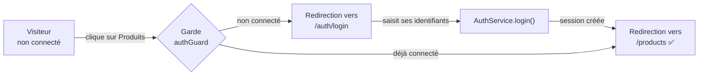
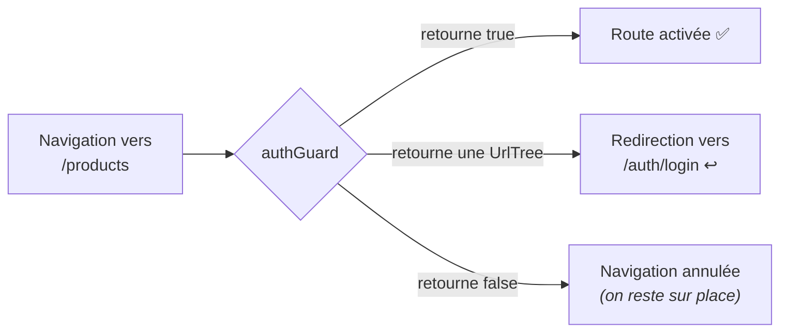

# M7 — Authentification et garde de route

> 🟢 **Parcours MODERN** — composants autonomes et signaux.
> Chapitre équivalent en LEGACY : [L7](../LEGACY/L7-AUTH.md).

**Scénario à réaliser en quasi-autonomie.** Aux chapitres précédents, vous avez été guidé pas
à pas pour acquérir les bases. Vous savez maintenant créer une fonctionnalité, la charger à la
demande, faire un formulaire, remonter un événement et partager un état par un service.

**L'authentification ne demande rien de nouveau** — sauf une notion, la *garde de route*, qui
est expliquée en détail. Pour le reste, ce chapitre vous donne la **structure** et les
**pistes** ; le code, c'est vous qui l'écrivez.

## ✨ Objectifs

- Construire une fonctionnalité complète de bout en bout, sans code fourni
- Conserver une session entre deux rechargements de page
- Protéger une route avec une **garde**
- Adapter le menu selon l'état de connexion

## 📁 Point de départ

Le projet du [chapitre 6](M6-HTTP.md), avec les produits chargés depuis l'API.

---

## 🎯 1 — Le résultat attendu



Le comportement à obtenir :

- `/products` est **inaccessible** sans connexion : on est renvoyé vers `/auth/login`
- Après connexion, on arrive sur `/products`
- Le menu affiche **Se connecter** ou **Se déconnecter** selon l'état
- La session **survit à un rechargement** (`F5`)

> ℹ️ **Authentification simulée.** Il n'y a pas de vrai serveur d'authentification ici :
> n'importe quel couple identifiant/mot de passe non vide sera accepté. L'objectif est de
> comprendre les **mécanismes Angular** (garde, service partagé, redirection), pas la
> cryptographie. En production, jamais de mot de passe côté client, et un jeton signé par le
> serveur.

---

## 🗂️ 2 — La structure à créer

Voici l'arborescence cible et le rôle de chaque fichier. **À vous de générer et de remplir.**

```
src/app/modules/auth/
├── auth.routes.ts                  les routes de la fonctionnalité
├── pages/login/                    la PAGE : assemble, ne contient pas la logique du formulaire
├── components/login-form/          le FORMULAIRE : saisie + validation, émet les identifiants
├── services/auth.ts                login() / logout() / isLoggedIn / currentUser
└── guards/auth-guard.ts            autorise ou redirige
```

| Fichier | Responsabilité | Vous l'avez déjà fait au… |
|---|---|---|
| `auth.routes.ts` | Déclarer la route `login` | chapitre 3 (`product.routes.ts`) |
| `pages/login/` | Afficher un titre et le formulaire, réagir à l'émission | chapitre 4 (assemblage) |
| `components/login-form/` | `FormGroup` typé à 2 champs, `output()` à la soumission | chapitre 5 (`ProductForm`) |
| `services/auth.ts` | Détenir l'état de session, le persister | chapitre 5 (`CartService`) |
| `guards/auth-guard.ts` | **Nouveau** — voir la section 4 | — |

Les commandes de génération (à adapter) :

```bash
npx ng g c modules/auth/pages/Login --skip-tests
npx ng g c modules/auth/components/LoginForm --skip-tests
npx ng g s modules/auth/services/Auth --skip-tests
npx ng g guard modules/auth/guards/Auth --skip-tests --implements=CanActivate
```

> ℹ️ **Sans `--implements=CanActivate`, la commande vous pose une question** (*« Which type of
> guard would you like to create? »*) et attend une réponse au clavier. En la précisant, la
> génération se fait d'un trait. Le fichier produit est une **garde fonctionnelle** — la forme
> actuelle, expliquée à la section 4.
> ⚠️ **Renommez les classes générées**, comme aux chapitres précédents : `ng g s` crée
> `export class Auth` dans `services/auth.ts` => renommez-la en **`AuthService`**. Les noms de
> fichiers, eux, restent tels quels.

*(Le fichier `auth.routes.ts`, lui, se crée à la main — comme `product.routes.ts`.)*

---

## 🧩 3 — Les pistes

### a. Les routes, chargées à la demande

Même schéma qu'au chapitre 3 : un fichier `auth.routes.ts` exportant un tableau
`AUTH_ROUTES`, avec une route `'login'`, branché dans `app.routes.ts` sous le chemin `'auth'`
via `loadChildren`.

> 💡 Une fois en place, vérifiez dans les journaux du build qu'un **deuxième** fichier apparaît
> dans `Lazy chunk files`.

### b. La page login : elle assemble, c'est tout

C'est le seul extrait de code que ce chapitre vous donne — parce qu'il illustre la séparation
page / composant, qui est le point à retenir :

```html
<!-- login.html : la page ne fait qu'assembler -->
<h1>Connexion</h1>

@if (error(); as message) {
  <p class="error">{{ message }}</p>
}

<app-login-form (connected)="onConnected($event)" />
```

La page écoute la sortie du formulaire, appelle le service, puis redirige. Pour rediriger
depuis le TypeScript :

```ts
private router = inject(Router);
this.router.navigate(['/products']);
```

### c. Le formulaire

Strictement le même patron que le `ProductForm` du chapitre 5 : un `FormGroup` typé avec deux
`FormControl` (`username`, `password`, tous deux `Validators.required`), un `output()` émis à
la soumission, et un bouton désactivé tant que le formulaire est invalide.

Pensez à `type="password"` sur le champ mot de passe.

### d. Le service : les questions à se poser

Plutôt que du code, voici les questions dont les réponses **sont** la conception. Prenez-les
dans l'ordre.

> **1. Où stocker la session pour qu'elle survive à un `F5` ?**
> Un signal seul vit en mémoire : rechargé, il est perdu. Que propose le navigateur pour
> conserver une petite valeur entre deux visites ?
> *(Piste : `localStorage.setItem` / `getItem` / `removeItem`.)*

> **2. Comment initialiser le signal au démarrage ?**
> Si une session existe déjà dans le stockage, l'utilisateur doit être considéré comme connecté
> **immédiatement**. Que mettre comme valeur initiale du signal ?

> **3. Que doit exposer le service pour que le menu sache quoi afficher ?**
> Le `Header` a besoin d'un booléen « connecté ou non ». Faut-il le stocker séparément, ou le
> **dériver** de l'utilisateur courant ?
> *(Rappel : au chapitre 5, le compteur du panier était dérivé avec `computed()`. Même
> situation ici.)*

> **4. Comment empêcher un composant de modifier l'état directement ?**
> Le signal interne doit rester `private`. Comment l'exposer en lecture seule ?
> *(Piste : `.asReadonly()`.)*

Les méthodes attendues : `login(username, password): boolean`, `logout(): void`, plus les
signaux `currentUser` et `isLoggedIn`.

### e. Le menu

Dans le `Header`, injectez le service et affichez conditionnellement :

```html
@if (isLoggedIn()) {
  <button matButton (click)="logout()">Se déconnecter</button>
} @else {
  <a matButton routerLink="/auth/login">Se connecter</a>
}
```

La déconnexion appelle `logout()` puis redirige vers `/home`.

---

## 🛡️ 4 — La garde de route

Seule notion réellement nouvelle du chapitre : elle est donc expliquée.

### Le principe

Une **garde** (*guard*) est une fonction que le routeur appelle **avant** d'activer une route.
Elle répond à une question simple : *le laisse-t-on passer ?*



### Sa signature

```ts
export const authGuard: CanActivateFn = (route, state) => {
  // doit retourner : true | false | UrlTree
};
```

| Valeur retournée | Effet | Quand l'utiliser |
|---|---|---|
| `true` | La navigation se poursuit | L'utilisateur a le droit |
| `false` | La navigation est **annulée** ; on reste sur la page courante | Rarement : l'utilisateur ne comprend pas ce qui se passe |
| `UrlTree` | La navigation est **redirigée** vers cette URL | ✅ Le bon choix : on l'envoie se connecter |

**Préférez l'`UrlTree`.** Avec `false`, le clic semble simplement ne rien faire — déroutant.
Avec une `UrlTree`, l'utilisateur atterrit sur la page de connexion : il comprend.

On la construit avec :

```ts
router.createUrlTree(['/auth/login'])
```

### Une particularité : `inject()` sans classe

Une garde est une **fonction**, pas une classe : pas de constructeur, donc pas d'injection par
constructeur. C'est précisément le rôle d'`inject()`, utilisable directement dans le corps de
la fonction :

```ts
export const authGuard: CanActivateFn = () => {
  const auth = inject(AuthService);
  const router = inject(Router);
  // TODO : si connecté -> true ; sinon -> une UrlTree vers /auth/login
};
```

> ℹ️ `inject()` ne fonctionne que dans un **contexte d'injection** : le corps d'une garde, un
> constructeur, un initialisateur de champ. Appelé dans une méthode quelconque, il échoue avec
> `NG0203`.

### La brancher

Sur la route à protéger, dans `app.routes.ts` :

```ts
{
  path: 'products',
  canActivate: [authGuard],
  loadChildren: () => import('./modules/product/product.routes').then((m) => m.PRODUCT_ROUTES),
}
```

`canActivate` reçoit un **tableau** : plusieurs gardes peuvent s'enchaîner (connexion, puis
rôle administrateur, par exemple). Toutes doivent autoriser le passage.

> 📖 [Les gardes de route](https://angular.dev/guide/routing/route-guards) ·
> [CanActivateFn](https://angular.dev/api/router/CanActivateFn)

---

## 🧪 Vérification

Déroulez ce scénario complet :

1. Ouvrez une fenêtre de **navigation privée** sur <http://localhost:4200>
2. Cliquez sur **Produits** => vous êtes renvoyé sur `/auth/login`
3. Saisissez n'importe quel identifiant et mot de passe, validez => vous arrivez sur `/products`
4. Le menu affiche maintenant **Se déconnecter**
5. Appuyez sur `F5` => **vous êtes toujours connecté** (c'est la question 1 de la section 3d)
6. Cliquez sur **Se déconnecter** => retour à l'accueil, le menu réaffiche **Se connecter**
7. Retentez `/products` en tapant l'URL directement => redirigé vers la connexion ✅

L'étape 7 est la plus importante : une garde protège la **route**, pas le lien. Masquer un
bouton ne protège rien.

> ⚠️ **Une garde n'est pas une sécurité.** Tout se passe dans le navigateur : un utilisateur
> averti peut contourner n'importe quelle garde. Elle sert à l'**expérience utilisateur**
> (ne pas afficher une page inutilisable). La vraie sécurité est **côté serveur**, qui doit
> refuser toute requête non authentifiée — toujours.

---

## 🎉 Challenge final

- [ ] `/auth/login` affiche le formulaire de connexion
- [ ] Le fichier de la fonctionnalité `auth` apparaît dans `Lazy chunk files`
- [ ] `/products` redirige vers la connexion quand on n'est pas connecté
- [ ] Après connexion, on est redirigé vers `/products`
- [ ] Le menu bascule entre **Se connecter** et **Se déconnecter**
- [ ] La session survit à un `F5`
- [ ] La déconnexion vide la session et ramène à l'accueil

## ✅ Bonus

- **Revenir là où on voulait aller.** Actuellement, après connexion on va toujours sur
  `/products`. Mémorisez l'URL demandée (la garde reçoit `state.url` en second paramètre),
  passez-la en paramètre de requête, et redirigez dessus après connexion.
- **Une garde de rôle.** Ajoutez un `adminGuard` qui n'autorise que l'utilisateur `admin`,
  et protégez une nouvelle route `/products/admin` avec **les deux** gardes.

## Récap

- Une fonctionnalité complète = des routes chargées à la demande + une page + un composant +
  un service. Vous savez faire tout cela depuis le chapitre 5.
- Une **garde** est une fonction appelée avant l'activation d'une route ; elle retourne `true`,
  `false`, ou une `UrlTree` pour rediriger — **préférez l'`UrlTree`**.
- `inject()` fonctionne dans une garde parce que c'est un contexte d'injection.
- Une garde soigne l'expérience utilisateur ; **la sécurité est côté serveur**.

➡️ **Chapitre suivant : [M8 — Tests](M8-TESTING.md)**
