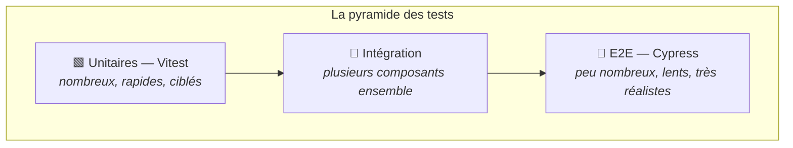

# M8 — Tests

> 🟢 **Parcours MODERN** — composants autonomes et signaux.
> Chapitre équivalent en LEGACY : [L8](../LEGACY/L8-TESTING.md).

**Scénario à réaliser en autonomie.** Ce chapitre est une **introduction** : on repart de
zéro, personne n'est censé avoir déjà écrit de test. Le guidage **redevient complet**, puis
s'allège progressivement : un premier test entièrement guidé, un deuxième à trous, un
troisième en autonomie — et le même escalier pour les tests de bout en bout.

## ✨ Objectifs

- Comprendre ce qu'un test apporte, et ce qu'il ne garantit pas
- Écrire des tests unitaires avec Vitest et le `TestBed` d'Angular
- Simuler un serveur HTTP dans un test
- Écrire un test de bout en bout avec Cypress
- Savoir quand écrire l'un plutôt que l'autre

## 📁 Point de départ

L'application complète du [chapitre 7](M7-AUTH.md).

---

## 🎯 1 — Deux familles de tests



| | Test unitaire | Test de bout en bout (E2E) |
|---|---|---|
| Ce qu'il teste | Une classe, un composant **isolé** | Le **parcours utilisateur** complet |
| Outil ici | **Vitest** (fourni avec Angular 22) | **Cypress** |
| Navigateur réel | Non (DOM simulé) | **Oui** |
| Serveur nécessaire | Non | Oui : l'application doit tourner |
| Vitesse | Millisecondes | Secondes |
| Quand les lancer | À chaque sauvegarde | Avant une mise en production |
| Ce qu'ils attrapent | Une régression de logique | Un enchaînement cassé, un bouton qui ne répond plus |

La forme de pyramide dit l'essentiel : **beaucoup** de tests unitaires (rapides, précis),
**peu** de tests E2E (lents mais qui vérifient que l'ensemble tient debout).

> ℹ️ **Un test ne prouve pas l'absence de bug.** Il prouve qu'un cas précis fonctionne. Sa
> vraie valeur apparaît dans six mois : quand une modification cassera cette fonctionnalité,
> le test le dira immédiatement plutôt qu'un utilisateur trois semaines plus tard.

---

## 🧪 2 — Le premier test unitaire (entièrement guidé)

Angular 22 utilise **Vitest** par défaut. Lancez la commande :

```bash
npx ng test
```

> ⚠️ **Le test fourni par défaut échoue** — c'est normal. Le projet généré contenait un test
> vérifiant le titre « Hello, ng-app-product », or vous avez remplacé ce contenu au chapitre 2.
> On va le réécrire.

Remplacez tout le contenu de **`src/app/app.spec.ts`** par :

```ts
import { TestBed } from '@angular/core/testing';
import { provideRouter } from '@angular/router';
import { provideHttpClient } from '@angular/common/http';
import { App } from './app';
import { routes } from './app.routes';

describe('App', () => {
  beforeEach(async () => {
    await TestBed.configureTestingModule({
      imports: [App],
      providers: [provideRouter(routes), provideHttpClient()],
    }).compileComponents();
  });

  it("devrait créer l'application", () => {
    const fixture = TestBed.createComponent(App);
    expect(fixture.componentInstance).toBeTruthy();
  });
});
```

Décortiquons — chaque mot a son rôle :

| Élément | Rôle |
|---|---|
| `describe(...)` | Regroupe des tests qui portent sur le même sujet |
| `it(...)` | **Un** test. Sa description dit ce qui est attendu |
| `beforeEach(...)` | Exécuté avant **chaque** test : on repart d'un état propre |
| `TestBed` | Le banc d'essai d'Angular : il construit une mini-application pour le test |
| `configureTestingModule` | Déclare ce dont le composant a besoin |
| `createComponent` | Instancie le composant |
| `expect(...).toBeTruthy()` | L'**assertion** : ce qui est vraiment vérifié |

### Pourquoi ces `providers` ?

`App` affiche le `Header`, qui utilise `routerLink` et les services. Sans
`provideRouter(routes)` ni `provideHttpClient()`, le `TestBed` ne saurait pas les fournir et
le test échouerait avec un `NullInjectorError`.

**Un test reconstruit une mini-application** : tout ce que le composant utilise réellement doit
y être déclaré.

> 💡 **Tester :** `npx ng test`
> ```
>  Test Files  1 passed (1)
>       Tests  1 passed (1)
> ```

---

## 🔶 3 — Le deuxième test : un composant (à trous)

Testons maintenant `ProductCard` : reçoit-il bien son produit et l'affiche-t-il ?

Deux nouveautés :

| Élément | Rôle |
|---|---|
| `fixture.componentRef.setInput('product', ...)` | Alimente une entrée `input()` depuis un test |
| `await fixture.whenStable()` | Attend qu'Angular ait fini de redessiner |

`whenStable()` est indispensable : en mode zoneless, l'affichage n'est pas mis à jour
instantanément après un changement.

🚧 **À compléter** — créez `src/app/modules/product/components/product-card/product-card.spec.ts` :

```ts
import { TestBed } from '@angular/core/testing';
import { ProductCard } from './product-card';

describe('ProductCard', () => {
  beforeEach(async () => {
    await TestBed.configureTestingModule({ imports: [ProductCard] }).compileComponents();
  });

  it('devrait afficher le nom et le prix du produit', async () => {
    const fixture = TestBed.createComponent(ProductCard);
    fixture.componentRef.setInput('product', { name: 'Clavier', price: 89 });
    await fixture.whenStable();

    const html = (fixture.nativeElement as HTMLElement).textContent ?? '';
    // TODO : vérifier que le texte affiché contient 'Clavier'
    //        (utilisez expect(html).toContain(...))
    // TODO : vérifier qu'il contient aussi '89'
  });

  it('devrait émettre buy au clic sur BUY', async () => {
    const fixture = TestBed.createComponent(ProductCard);
    const product = { name: 'Souris', price: 45 };
    fixture.componentRef.setInput('product', product);
    await fixture.whenStable();

    let emitted: unknown = null;
    fixture.componentInstance.buy.subscribe((p) => (emitted = p));

    // TODO : récupérer le <button> et cliquer dessus
    //        const button = (fixture.nativeElement as HTMLElement).querySelector('button');
    //        button?.click();

    // TODO : vérifier que `emitted` vaut bien le produit
    //        (expect(emitted).toEqual(product))
  });
});
```

> 💡 **Tester :** `npx ng test` => `Tests  3 passed (3)`

> ℹ️ **Remarquez ce qu'on teste.** On ne vérifie pas que la carte est jolie, ni la couleur du
> bouton : on vérifie son **contrat** — elle affiche ce qu'on lui donne, et elle prévient quand
> on clique. Un test qui vérifierait la mise en page casserait au premier changement de style,
> sans rien apporter.

---

## 🟩 4 — Le troisième test : un service (en autonomie)

Testons `ProductService`. Problème : il appelle un vrai serveur. Or un test ne doit
**jamais** dépendre d'un serveur — sinon il échoue quand l'API est éteinte, devient lent, et
son résultat varie.

La solution : **simuler** les réponses HTTP.

| Outil | Rôle |
|---|---|
| `provideHttpClientTesting()` | Remplace le vrai client HTTP par une version simulée |
| `httpMock.expectOne(url)` | Affirme qu'une requête vers cette URL a été émise |
| `req.flush(donnees)` | Fournit la réponse de votre choix |
| `httpMock.verify()` | Vérifie qu'aucune requête n'a été oubliée |

Voici le squelette. **À vous de le compléter** — vous avez tout ce qu'il faut dans le tableau
ci-dessus.

🚧 **À compléter** — `src/app/modules/product/services/product.spec.ts` :

```ts
import { TestBed } from '@angular/core/testing';
import { provideHttpClient } from '@angular/common/http';
import { HttpTestingController, provideHttpClientTesting } from '@angular/common/http/testing';
import { ProductService } from './product';
import { Product } from '../models/product';

describe('ProductService', () => {
  let service: ProductService;
  let httpMock: HttpTestingController;

  beforeEach(() => {
    TestBed.configureTestingModule({
      providers: [provideHttpClient(), provideHttpClientTesting()],
    });
    service = TestBed.inject(ProductService);
    httpMock = TestBed.inject(HttpTestingController);
  });

  afterEach(() => httpMock.verify());

  it('getProducts devrait appeler GET /products et renvoyer la liste', () => {
    const fake: Product[] = [{ id: 1, name: 'Clavier', price: 89 }];
    let received: Product[] | undefined;

    // TODO : appeler service.getProducts() et s'y abonner,
    //        en stockant le résultat dans `received`

    // TODO : récupérer la requête avec httpMock.expectOne('http://localhost:3004/products')
    //        puis vérifier que sa méthode est 'GET' (req.request.method)

    // TODO : répondre avec req.flush(fake)

    // TODO : vérifier que `received` vaut `fake`
  });
});
```

> 💡 **Tester :** `npx ng test` => `Tests  4 passed (4)`
>
> Coupez json-server et relancez les tests : **ils passent toujours**. C'est la preuve que la
> simulation fonctionne — le test ne dépend d'aucun serveur.

---

## 🌐 5 — Les tests de bout en bout avec Cypress

Les tests unitaires vérifient des pièces isolées. Reste une question : **l'ensemble
fonctionne-t-il vraiment ?** C'est le rôle des tests E2E, qui pilotent un vrai navigateur.

### Installation (guidée)

```bash
npm install -D cypress@16
```

Créez **`cypress.config.ts`** à la racine du projet :

```ts
import { defineConfig } from 'cypress';

export default defineConfig({
  e2e: {
    baseUrl: 'http://localhost:4200',
    supportFile: false,
    specPattern: 'cypress/e2e/**/*.cy.ts',
  },
});
```

| Option | Rôle |
|---|---|
| `baseUrl` | L'adresse de l'application : `cy.visit('/')` s'y rapportera |
| `supportFile: false` | Pas de fichier de configuration global (inutile ici) |
| `specPattern` | Où Cypress cherche les tests |

> ⚠️ **L'application doit tourner.** Contrairement aux tests unitaires, Cypress pilote un vrai
> navigateur : sans `npm start` actif dans un autre terminal, tous les tests échoueront sur une
> erreur de connexion.

### Premier test E2E (entièrement guidé)

Créez **`cypress/e2e/navigation.cy.ts`** :

```ts
describe("Navigation dans l'application", () => {
  it("affiche la page d'accueil", () => {
    cy.visit('/');
    cy.contains('h1', 'Bienvenue');
  });
});
```

Les commandes Cypress essentielles :

| Commande | Rôle |
|---|---|
| `cy.visit(url)` | Ouvre une page |
| `cy.contains(selecteur, texte)` | Trouve un élément contenant ce texte — **échoue** s'il n'existe pas |
| `cy.get(selecteur)` | Sélectionne un élément (syntaxe CSS) |
| `.click()`, `.type(texte)` | Interagit |
| `cy.url().should('include', ...)` | Vérifie l'URL courante |

Lancez, dans un terminal où `npm start` tourne déjà par ailleurs :

```bash
npx cypress run --e2e
```

> 💡 **Tester :**
> ```
>   Navigation dans l'application
>     ✓ affiche la page d'accueil (500ms)
>
>   1 passing (638ms)
> ```
>
> Pour une exécution **visuelle** (très parlante : on voit le navigateur agir) :
> `npx cypress open`

### Deuxième test E2E (à trous)

🚧 **À compléter** — ajoutez ce test dans le même fichier :

```ts
it('redirige vers la connexion quand on demande les produits', () => {
  // TODO : visiter '/products'
  // TODO : vérifier qu'un <h1> contient 'Connexion'
  //        (c'est la garde du chapitre 7 qui doit nous rediriger)
});
```

### Troisième test E2E (en autonomie)

Écrivez maintenant, dans **`cypress/e2e/login-and-cart.cy.ts`**, le test du parcours complet :

1. visiter `/products` — on est redirigé vers la connexion
2. remplir les deux champs et valider
3. vérifier qu'on est bien arrivé sur `/products`
4. vérifier que la pastille du panier affiche `0`
5. cliquer sur le premier bouton **BUY**
6. vérifier que la pastille affiche `1`

Deux indices pour les sélecteurs :

```ts
cy.get('input[formcontrolname="username"]').type('boris');
cy.get('.mat-badge-content').should('contain', '1');
```

> 💡 **Tester :** json-server doit tourner pour que les produits s'affichent.
> `npx cypress run --e2e` => `All specs passed!`

> ℹ️ **Ce test vaut à lui seul dix tests unitaires** — et il est aussi dix fois plus lent. Il
> traverse la garde, le routeur, le formulaire, le service HTTP, le service de panier et
> l'affichage. Si l'un de ces maillons casse, il le dit. Mais il ne dira pas *lequel* : c'est
> précisément ce que les tests unitaires, eux, savent faire.

---

## 🎉 Challenge final

- [ ] `npx ng test` affiche **4 tests verts**
- [ ] Les tests unitaires passent **même avec json-server éteint**
- [ ] Cypress est installé et configuré
- [ ] Les trois tests E2E passent
- [ ] Vous savez dire quand écrire un test unitaire plutôt qu'un test E2E

## ✅ Bonus

- **Voir un test échouer, exprès.** Dans `product-card.html`, remplacez `{{ product().name }}`
  par du texte en dur. Relancez : le test rouge vous dit exactement ce qui a changé. Puis
  annulez. *Un test qu'on n'a jamais vu échouer ne prouve rien.*
- **La couverture de code.** `npx ng test --coverage` indique le pourcentage de code exécuté
  par les tests. Utile pour repérer les zones oubliées — mais méfiez-vous : 100 % de couverture
  ne signifie pas 0 bug.
- **Tester la garde.** Écrivez un test unitaire pour `authGuard` : connecté => `true`,
  non connecté => une `UrlTree`.

## Récap

- **Vitest** pour les tests unitaires (rapides, isolés), **Cypress** pour le bout en bout
  (lent, réaliste). Beaucoup des premiers, peu des seconds.
- Le `TestBed` reconstruit une mini-application : tout ce qu'utilise le composant doit y être
  déclaré.
- On teste le **contrat** d'un composant (ce qu'il affiche, ce qu'il émet), pas sa mise en page.
- `provideHttpClientTesting()` simule le serveur : le test devient rapide et fiable.
- Un test E2E vérifie que l'ensemble tient debout ; un test unitaire dit **où** ça casse.

---

## 🌉 Pour aller plus loin

| Outil | Ce que c'est |
|---|---|
| [Playwright](https://playwright.dev/) | Alternative à Cypress, multi-navigateurs, très rapide. Même philosophie. |
| [Testing Library](https://testing-library.com/docs/angular-testing-library/intro/) | Une autre façon d'écrire les tests de composants, centrée sur l'utilisateur |
| [Vitest](https://vitest.dev/) | La documentation de l'outil de test, au-delà d'Angular |

> ℹ️ **Si vous croisez « Protractor »** dans un tutoriel : c'était l'outil E2E historique
> d'Angular. Il est **abandonné depuis 2023** et retiré du framework. Cypress et Playwright
> l'ont remplacé.

🎓 **Vous avez terminé le parcours MODERN.** Reste
**[BONUS.md](../BONUS.md)** pour les ouvertures : intercepteur HTTP, gestion d'état, outillage.
