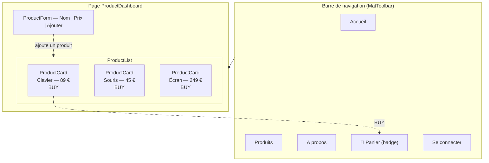
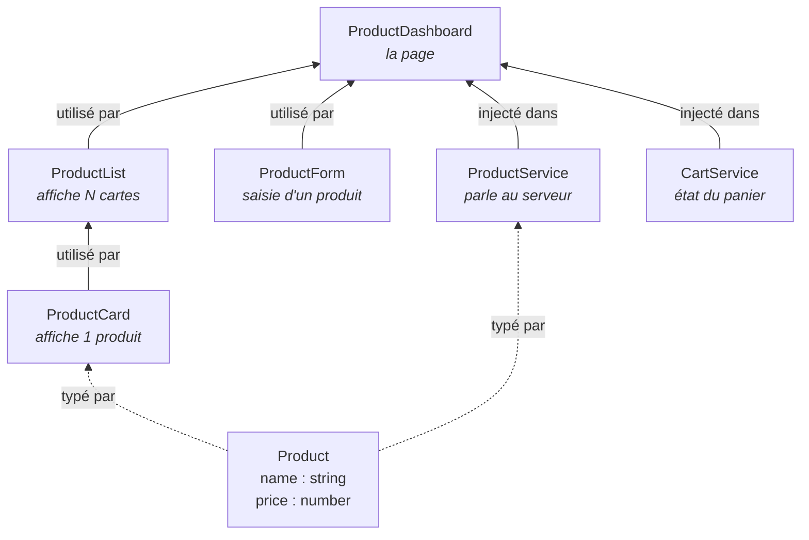

# Lab Angular — Application « Product »

Lab pratique : vous construisez une petite application Angular complète, de la création du
projet jusqu'aux tests, en passant par la navigation, le chargement à la demande, les
formulaires, les appels HTTP et l'authentification.

> **Niveau : initiation.** Ce lab suppose que vous connaissez les bases de **HTML, CSS et
> JavaScript/TypeScript** (variables, fonctions, tableaux, classes). Il ne suppose **rien**
> sur Angular : la création du projet, la structure des dossiers et chaque commande de
> l'outil en ligne de commande sont expliquées au fur et à mesure.

---

## 1 — Ce que vous allez construire

Une application de catalogue de produits : une barre de navigation, une page d'accueil, une
page « Produits » protégée par une connexion, un formulaire d'ajout, et un panier dont le
compteur s'incrémente dans le menu.



Chaque encadré de ce schéma est un **composant** : une brique d'interface autonome, avec son
propre fichier de logique (`.ts`), son gabarit HTML (`.html`) et son style (`.scss`). Tout
l'enjeu d'Angular est là — découper une page en composants, puis les faire communiquer.

### Le modèle de l'application

Voici les pièces que vous allez créer et la façon dont elles se parlent. Ne cherchez pas à
tout comprendre maintenant : revenez-y après le chapitre 3, il s'éclairera d'un coup.



Deux familles de briques, qu'il faut distinguer dès maintenant :

| Brique | Rôle | Exemple ici |
|---|---|---|
| **Composant** | Affiche quelque chose et réagit aux clics | `ProductCard`, `ProductForm` |
| **Service** | Ne montre rien ; détient une donnée ou un savoir-faire partagé | `ProductService`, `CartService` |

La règle qui en découle, et qui structure tout le lab : **un composant affiche, un service
sait**. Quand deux composants éloignés doivent partager une information (la page produits et
le badge du panier, par exemple), on ne les relie pas directement — on passe par un service.

---

## 2 — Le parcours en 8 chapitres

Les deux parcours proposés (voir section 4) suivent **exactement les mêmes étapes**. Seule
la façon d'écrire le code change.

| Ch. | Titre | Ce que vous apprenez | Debrief |
|---|---|---|---|
| **1** | Mise en place | Créer un projet, comprendre sa structure, ajouter une bibliothèque de composants | |
| **2** | Navigation | Afficher une page selon l'URL, faire une barre de menu, gérer la page 404 | |
| **3** | Feature Product & chargement à la demande | Regrouper une fonctionnalité, ne télécharger son code qu'au besoin | ⬅ **1** |
| **4** | Interface graphique | Découper en composants, passer une donnée du parent vers l'enfant | ⬅ **2** |
| **5** | Formulaires & interactions | Saisir et valider, remonter une donnée de l'enfant vers le parent, partager un état | ⬅ **3** |
| **6** | Requêtes HTTP | Appeler une API, comprendre ce qu'est un flux de données | |
| **7** | Authentification & garde | Construire un module en quasi-autonomie, protéger une page | |
| **8** | Tests | Écrire des tests unitaires, découvrir les tests de bout en bout | |

### Les 3 debriefs

Trois points d'arrêt collectifs, après les chapitres 3, 4 et 5. On y fait le point ensemble :
ce sont les moments où on compare les deux parcours et où on répond aux questions de fond.
**Si vous prenez de l'avance, ne sautez pas ces moments** — c'est là qu'on consolide.

### Comment le guidage évolue

Le lab ne vous tient pas la main de la même façon du début à la fin :

| Chapitres | Ce à quoi vous attendre |
|---|---|
| **1 à 3** | Très guidé. Chaque fichier à créer, vider ou modifier est indiqué explicitement. |
| **4 et 5** | Codes à trou. Vous complétez des `TODO`, en vous appuyant sur les tableaux et les liens de doc. |
| **6** | Très guidé à nouveau : les flux de données sont une notion neuve, elle est expliquée pas à pas. |
| **7** | Quasi-autonomie. On vous donne la structure et les pistes, vous écrivez le code. |
| **8** | Très guidé : c'est une introduction aux tests, on repart de zéro. |

Le guidage n'est donc pas décroissant : il **redescend** quand une notion nouvelle arrive.

---

## 3 — Prérequis

### Node.js 22.22.3 minimum (ou 24)

Angular 22 **refuse de démarrer** sur une version de Node trop ancienne. Vérifiez :

```bash
node -v
```

Si la version affichée est inférieure à `v22.22.3`, basculez sur Node 24 avec
[nvm](https://github.com/nvm-sh/nvm) :

```bash
nvm install 24
nvm use 24
```

> ⚠️ **Piège — le terminal oublie votre choix.**
> - *Symptôme :* `nvm use 24` fonctionne, mais dans un **nouveau** terminal `node -v` réaffiche
>   l'ancienne version, et `ng` refuse de démarrer.
> - *Cause :* `nvm use` ne vaut que pour le terminal courant.
> - *Correctif :* refaire `nvm use 24` dans chaque nouveau terminal, ou fixer le défaut une
>   fois pour toutes avec `nvm alias default 24`.

### L'outil en ligne de commande Angular

Le lab utilise `npx ng`, qui prend l'outil **du projet** — c'est la méthode la plus sûre, car
une installation globale ancienne peut entrer en conflit.

```bash
npx ng version
```

> 💡 Si vous préférez taper `ng` plutôt que `npx ng`, installez l'outil globalement avec
> `npm install -g @angular/cli@22`. En cas d'erreur étrange au lancement (par exemple
> `primordials is not defined`), c'est le signe d'une vieille version globale : désinstallez-la
> avec `npm uninstall -g angular-cli @angular/cli`, puis réinstallez.

### Un éditeur

[VS Code](https://code.visualstudio.com/) avec l'extension
[Angular Language Service](https://marketplace.visualstudio.com/items?itemName=Angular.ng-template),
qui signale les erreurs dans les gabarits HTML pendant la frappe.

---

## 4 — Quel parcours choisir ?

Angular a profondément changé. Deux façons d'organiser une application coexistent
aujourd'hui, et vous rencontrerez les deux en entreprise. **Ce lab les couvre toutes les deux,
avec la même application à l'arrivée.**

| | 🟢 **MODERN** | 🟠 **LEGACY** |
|---|---|---|
| Organisation | Composants **autonomes** (*standalone*) | **Modules** (`NgModule`) |
| Depuis | Angular 14+, défaut depuis la v17 | Angular 2 à 16 |
| État réactif | **Signaux** (`signal`, `computed`) | **RxJS** (`Observable`, `BehaviorSubject`) |
| Ce qu'on écrit | `input()`, `output()`, `inject()` | `@Input()`, `@Output()`, constructeur |
| Quand le choisir | Tout **nouveau** projet | Une base de code **existante** à reprendre |

### Alors, lequel ?

**Choisissez selon votre situation réelle :**

- Vous démarrez dans Angular, ou vous allez créer un projet neuf
  => **[Parcours MODERN](MODERN/M1-SCAFFOLD.md)**
- Vous arrivez sur un projet existant écrit en `NgModule`, ou votre entreprise en maintient un
  => **[Parcours LEGACY](LEGACY/L1-SCAFFOLD.md)**
- Vous ne savez pas => prenez **MODERN**. C'est la direction d'Angular, et le chapitre 1 du
  parcours LEGACY reste lisible ensuite pour comprendre un projet ancien.

> ℹ️ **Les deux parcours sont en miroir.** Le chapitre M4 traite du même sujet que le L4. Chaque
> chapitre porte un lien vers son jumeau : vous pouvez comparer les deux écritures à tout
> moment, c'est même très formateur après un debrief.

**Avant de partir**, faites d'abord la [mise en place commune](00-SETUP.md) : elle installe
le nécessaire et n'est à faire qu'une fois.

---

## 5 — Arborescence du lab

```
02-minishop-lab/
├── README.md              <- vous êtes ici
├── 00-SETUP.md            Mise en place commune (à faire en premier)
├── MODERN/                Parcours composants autonomes + signaux
│   M1-SCAFFOLD.md … M8-TESTING.md
├── LEGACY/                Parcours NgModule + RxJS
│   L1-SCAFFOLD.md … L8-TESTING.md
├── BONUS.md               Ouvertures : intercepteur, gestion d'état, outillage
├── solution/
│   ├── modern/            Application complète, parcours MODERN
│   └── legacy/            Application complète, parcours LEGACY
├── assets/images/         Captures d'écran utilisées dans les chapitres
└── archives/              Énoncé d'origine (support formateur)
```

> 🔑 **À propos de `solution/`.** Les deux applications complètes s'y trouvent, et elles
> fonctionnent (build et tests verts). Elles sont là **en dernier recours** : allez-y quand
> vous êtes bloqué plus de dix minutes, pas avant 😉. Recopier la solution sans avoir cherché
> ne vous apprendra rien.
>
> Pour les lancer :
> ```bash
> cd solution/modern && npm install && npm start
> ```

---

## 6 — Pour aller plus loin

L'écosystème Angular ne s'arrête pas à ce lab. Voici ce qui vous attendra sur un vrai projet —
rien de tout cela n'est nécessaire ici, mais il est utile de savoir que ça existe.

| Outil | À quoi ça sert | Quand ça devient utile |
|---|---|---|
| [NgRx](https://ngrx.io/) | Centralise l'état de l'application dans un magasin unique | Quand beaucoup de composants éloignés partagent le même état |
| [NgRx Signal Store](https://ngrx.io/guide/signals) | Même idée, en s'appuyant sur les signaux | Alternative moderne, plus légère, sur un projet récent |
| [Angular DevTools](https://angular.dev/tools/devtools) | Extension navigateur : inspecte l'arbre des composants et les performances | Dès qu'un affichage se comporte bizarrement |
| [Compodoc](https://compodoc.app/) | Génère un site de documentation à partir du code | Pour transmettre un projet à une autre équipe |
| [Storybook](https://storybook.js.org/) | Catalogue interactif de vos composants, isolés | Quand l'équipe construit une bibliothèque de composants |
| [ESLint](https://angular.dev/tools/cli/eslint) | Repère les erreurs et impose un style de code commun | Dès qu'on travaille à plusieurs |

Voir aussi **[BONUS.md](BONUS.md)** pour l'intercepteur HTTP et le préchargement des routes.

---

## Récap

- Vous construisez **une application complète**, en 8 chapitres, avec 3 debriefs collectifs.
- Deux parcours au choix — **MODERN** (autonome + signaux) ou **LEGACY** (`NgModule` + RxJS) —
  qui aboutissent à la **même application**.
- Le guidage est fort au début, s'allège au milieu, et **redevient fort** quand une notion
  neuve apparaît (chapitres 6 et 8).
- `solution/` contient les deux applications finies : c'est un filet, pas un raccourci.

➡️ **Commencez par la [mise en place commune](00-SETUP.md).**
